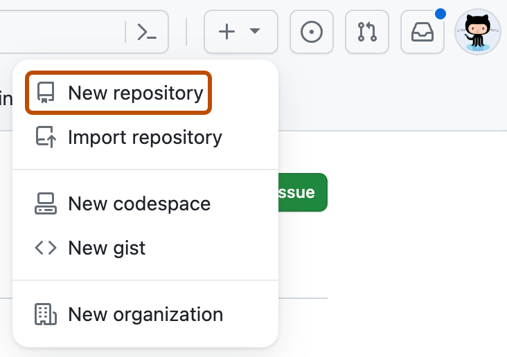
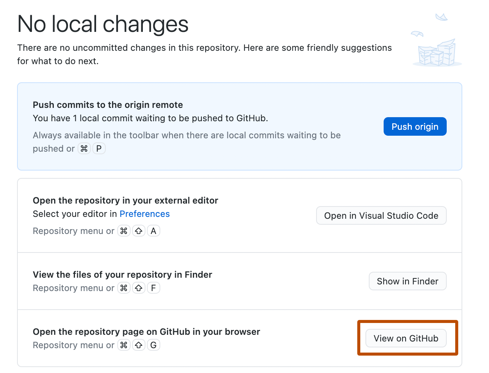

# 4. Repositories erstellen und verwalten

- [Neues Repository erstellen](#Neues_Repository_erstellen)
- [Repository klonen](#)
- [README und Lizenz hinzufügen](#)
- [.gitignore Dateien](#)
- [Repository-Einstellungen](#Repository-Einstellungen_konfigurieren)
- [Releases erstellen](#Releases_erstellen)
- [Repository archivieren und löschen](#Repository_archivieren_und_löschen)

<A name="Neues_Repository_erstellen"></A>
## Neues Repository erstellen



Die Erstellung eines neuen Repositories ist der erste Schritt bei der Arbeit mit GitHub. Ein Repository dient als zentraler Speicherort für Ihr Projekt und enthält alle Dateien, den Versionsverlauf und die Zusammenarbeitsfunktionen.

### Repository auf GitHub erstellen

Es gibt mehrere Wege, ein neues Repository auf GitHub zu erstellen. Der direkteste Weg führt über die GitHub-Weboberfläche:

1. Melden Sie sich bei Ihrem GitHub-Konto an und navigieren Sie zur GitHub-Startseite.

2. Klicken Sie auf das "+"-Symbol in der oberen rechten Ecke der Seite und wählen Sie "Neues Repository" aus dem Dropdown-Menü.

3. Auf der Seite "Neues Repository erstellen" müssen Sie verschiedene Informationen angeben:

   - **Repository-Name**: Wählen Sie einen kurzen, aussagekräftigen Namen für Ihr Repository. Der Name sollte den Inhalt oder Zweck des Projekts widerspiegeln und darf keine Leerzeichen enthalten. Bindestriche oder Unterstriche können verwendet werden, um Wörter zu trennen.

   - **Beschreibung**: Fügen Sie eine optionale, aber empfohlene kurze Beschreibung hinzu, die den Zweck des Repositories erklärt.

   - **Sichtbarkeit**: Wählen Sie, ob das Repository öffentlich oder privat sein soll. Öffentliche Repositories sind für jeden im Internet sichtbar, während private Repositories nur für Sie und ausdrücklich eingeladene Mitarbeiter zugänglich sind.

   - **README-Datei initialisieren**: Es wird empfohlen, diese Option zu aktivieren, um automatisch eine README.md-Datei zu erstellen. Diese Datei dient als Einstiegspunkt für Ihr Projekt und sollte grundlegende Informationen über das Projekt enthalten.

   - **Gitignore hinzufügen**: Wählen Sie eine .gitignore-Vorlage basierend auf der Programmiersprache oder dem Framework Ihres Projekts. Die .gitignore-Datei teilt Git mit, welche Dateien oder Verzeichnisse ignoriert werden sollen (z.B. temporäre Dateien, Build-Artefakte).

   - **Lizenz auswählen**: Wählen Sie eine Lizenz für Ihr Projekt, um festzulegen, wie andere Ihren Code verwenden dürfen. Für Open-Source-Projekte sind MIT, Apache 2.0 und GNU GPL beliebte Optionen.

4. Nachdem Sie alle erforderlichen Informationen eingegeben haben, klicken Sie auf die Schaltfläche "Repository erstellen".

Nach der Erstellung wird Ihr neues Repository angezeigt, und Sie können beginnen, Dateien hinzuzufügen, zu bearbeiten und zu verwalten.

### Repository mit GitHub Desktop erstellen



GitHub Desktop bietet eine benutzerfreundliche Oberfläche für die Erstellung und Verwaltung von Repositories:

1. Öffnen Sie GitHub Desktop und melden Sie sich mit Ihrem GitHub-Konto an.

2. Klicken Sie auf "File" (Datei) in der Menüleiste und wählen Sie "New Repository..." (Neues Repository...).

3. Im Dialogfeld "Create a New Repository" (Neues Repository erstellen) geben Sie die folgenden Informationen ein:
   - Name: Der Name des Repositories
   - Lokaler Pfad: Der Speicherort auf Ihrem Computer
   - Beschreibung: Eine optionale kurze Beschreibung
   - Git Ignore: Eine Vorlage für Dateien, die ignoriert werden sollen
   - Lizenz: Eine Lizenz für Ihr Projekt

4. Klicken Sie auf "Create Repository" (Repository erstellen).

5. Um das lokale Repository auch auf GitHub zu veröffentlichen, klicken Sie auf "Publish repository" (Repository veröffentlichen) und wählen Sie die gewünschten Einstellungen für die Sichtbarkeit.

### Repository über die Kommandozeile erstellen

Sie können auch die Git-Kommandozeile verwenden, um ein Repository zu erstellen und es mit GitHub zu verbinden:

1. Öffnen Sie ein Terminal oder eine Eingabeaufforderung.

2. Navigieren Sie zu dem Verzeichnis, in dem Sie Ihr Projekt erstellen möchten, oder zu einem bestehenden Projektverzeichnis.

3. Initialisieren Sie ein neues Git-Repository:
   ```
   git init
   ```

4. Fügen Sie Ihre Projektdateien hinzu und erstellen Sie einen ersten Commit:
   ```
   git add .
   git commit -m "Erster Commit"
   ```

5. Erstellen Sie ein neues Repository auf GitHub über die Weboberfläche (ohne README, .gitignore oder Lizenz zu initialisieren).

6. Verbinden Sie Ihr lokales Repository mit dem GitHub-Repository:
   ```
   git remote add origin https://github.com/benutzername/repository-name.git
   ```

7. Pushen Sie Ihren Code zum GitHub-Repository:
   ```
   git push -u origin main
   ```

   Hinweis: Neuere Git-Versionen verwenden "main" als Standardbranch-Namen. Ältere Versionen könnten "master" verwenden.

<A name="Repository-Einstellungen_konfigurieren"></A>
## Repository-Einstellungen konfigurieren

Nach der Erstellung eines Repositories können Sie verschiedene Einstellungen konfigurieren, um es an Ihre Bedürfnisse anzupassen.

### Allgemeine Einstellungen

Die allgemeinen Einstellungen eines Repositories können über die Registerkarte "Settings" (Einstellungen) auf der Repository-Seite konfiguriert werden:

1. **Repository-Name und Beschreibung**: Sie können den Namen und die Beschreibung Ihres Repositories ändern.

2. **Sichtbarkeit**: Sie können die Sichtbarkeit zwischen öffentlich und privat ändern (beachten Sie, dass dies je nach GitHub-Plan eingeschränkt sein kann).

3. **Features**: Sie können bestimmte Features wie Issues, Wikis und Diskussionen aktivieren oder deaktivieren.

4. **Merge-Button-Optionen**: Sie können festlegen, welche Arten von Merges (Standard, Squash, Rebase) für Pull Requests erlaubt sind.

5. **GitHub Pages**: Sie können GitHub Pages konfigurieren, um eine Website direkt aus Ihrem Repository zu hosten.

6. **Automatische Branch-Löschung**: Sie können die automatische Löschung von Branches nach dem Zusammenführen von Pull Requests aktivieren.

### Branch-Schutzregeln

Branch-Schutzregeln sind wichtig, um die Integrität Ihres Codes zu gewährleisten, insbesondere für wichtige Branches wie "main":

1. Navigieren Sie zu "Settings" > "Branches" > "Branch protection rules" (Branch-Schutzregeln).

2. Klicken Sie auf "Add rule" (Regel hinzufügen) und geben Sie den Branch-Namen ein (z.B. "main").

3. Konfigurieren Sie die gewünschten Schutzoptionen:
   - **Require pull request reviews before merging** (Pull-Request-Reviews vor dem Zusammenführen erforderlich): Erfordert, dass Änderungen überprüft und genehmigt werden, bevor sie zusammengeführt werden können.
   - **Require status checks to pass before merging** (Statusprüfungen müssen vor dem Zusammenführen bestanden werden): Stellt sicher, dass automatisierte Tests oder andere Checks bestanden werden.
   - **Require signed commits** (Signierte Commits erforderlich): Erfordert, dass alle Commits kryptografisch signiert sind.
   - **Include administrators** (Administratoren einbeziehen): Wendet die Regeln auch auf Repository-Administratoren an.
   - **Restrict who can push to matching branches** (Einschränken, wer auf übereinstimmende Branches pushen kann): Begrenzt, wer direkt auf den Branch pushen kann.

4. Klicken Sie auf "Create" (Erstellen), um die Regel zu speichern.

### Mitarbeiter und Teams

Sie können anderen Benutzern oder Teams Zugriff auf Ihr Repository gewähren:

1. Navigieren Sie zu "Settings" > "Collaborators and teams" (Mitarbeiter und Teams).

2. Um einen einzelnen Mitarbeiter hinzuzufügen:
   - Klicken Sie auf "Add people" (Personen hinzufügen).
   - Suchen Sie nach dem GitHub-Benutzernamen, der vollständigen Namen oder der E-Mail-Adresse.
   - Wählen Sie die entsprechende Zugriffsebene (Read, Triage, Write, Maintain, Admin).
   - Klicken Sie auf "Add" (Hinzufügen).

3. Um ein Team hinzuzufügen (nur für Organisations-Repositories):
   - Klicken Sie auf "Add teams" (Teams hinzufügen).
   - Suchen Sie nach dem Teamnamen.
   - Wählen Sie die entsprechende Zugriffsebene.
   - Klicken Sie auf "Add" (Hinzufügen).

### Webhooks und Integrationen

Webhooks ermöglichen es GitHub, Ereignisse an externe Dienste zu senden, während Integrationen die Funktionalität von GitHub erweitern:

1. **Webhooks einrichten**:
   - Navigieren Sie zu "Settings" > "Webhooks" > "Add webhook" (Webhook hinzufügen).
   - Geben Sie die Payload-URL ein (die URL, an die GitHub Ereignisse senden soll).
   - Wählen Sie den Content-Typ.
   - Konfigurieren Sie ein optionales Secret für die Sicherheit.
   - Wählen Sie die Ereignisse aus, die den Webhook auslösen sollen.
   - Klicken Sie auf "Add webhook" (Webhook hinzufügen).

2. **GitHub Apps installieren**:
   - Navigieren Sie zu "Settings" > "GitHub Apps" > "Installed GitHub Apps" (Installierte GitHub Apps).
   - Klicken Sie auf "Browse GitHub Apps" (GitHub Apps durchsuchen) oder "Configure" (Konfigurieren) für bereits installierte Apps.
   - Folgen Sie den Anweisungen zur Installation oder Konfiguration der gewählten App.

## Dateien und Verzeichnisse verwalten

Die Verwaltung von Dateien und Verzeichnissen ist ein wesentlicher Teil der Arbeit mit GitHub-Repositories.

### Dateien über die Weboberfläche hinzufügen

GitHub bietet eine benutzerfreundliche Weboberfläche zum Hinzufügen und Bearbeiten von Dateien:

1. Navigieren Sie zu Ihrem Repository und klicken Sie auf "Add file" (Datei hinzufügen) > "Create new file" (Neue Datei erstellen) oder "Upload files" (Dateien hochladen).

2. Für neue Dateien:
   - Geben Sie einen Dateinamen ein, einschließlich der Erweiterung (z.B. "index.html").
   - Fügen Sie den Inhalt der Datei hinzu.
   - Scrollen Sie nach unten, geben Sie eine Commit-Nachricht ein und wählen Sie, ob Sie direkt zum Hauptbranch committen oder einen neuen Branch und Pull Request erstellen möchten.
   - Klicken Sie auf "Commit new file" (Neue Datei committen).

3. Für hochgeladene Dateien:
   - Ziehen Sie Dateien in den Upload-Bereich oder klicken Sie auf "choose your files" (Dateien auswählen).
   - Geben Sie eine Commit-Nachricht ein und wählen Sie den Branch.
   - Klicken Sie auf "Commit changes" (Änderungen committen).

### Dateien über die Weboberfläche bearbeiten

Bestehende Dateien können direkt über die GitHub-Weboberfläche bearbeitet werden:

1. Navigieren Sie zu der Datei, die Sie bearbeiten möchten, und klicken Sie auf das Bleistift-Symbol in der oberen rechten Ecke der Dateiansicht.

2. Nehmen Sie Ihre Änderungen im Editor vor.

3. Scrollen Sie nach unten, geben Sie eine Commit-Nachricht ein und wählen Sie, ob Sie direkt zum Hauptbranch committen oder einen neuen Branch und Pull Request erstellen möchten.

4. Klicken Sie auf "Commit changes" (Änderungen committen).

### Dateien mit GitHub Desktop verwalten

GitHub Desktop bietet eine grafische Oberfläche für die Verwaltung von Dateien:

1. Öffnen Sie GitHub Desktop und wählen Sie Ihr Repository aus.

2. Verwenden Sie Ihren bevorzugten Texteditor oder Datei-Explorer, um Dateien in Ihrem lokalen Repository-Verzeichnis hinzuzufügen, zu bearbeiten oder zu löschen.

3. In GitHub Desktop werden die Änderungen automatisch erkannt und im "Changes" (Änderungen) Tab angezeigt.

4. Wählen Sie die Dateien aus, die Sie committen möchten, geben Sie eine Commit-Nachricht ein und klicken Sie auf "Commit to [branch]" (An [Branch] committen).

5. Klicken Sie auf "Push origin" (An Origin pushen), um Ihre Änderungen auf GitHub hochzuladen.

### Dateien über die Kommandozeile verwalten

Die Git-Kommandozeile bietet die umfassendste Kontrolle über die Dateiverwaltung:

1. Navigieren Sie in Ihrem Terminal oder Ihrer Eingabeaufforderung zu Ihrem lokalen Repository.

2. Um den aktuellen Status zu überprüfen:
   ```
   git status
   ```

3. Um Dateien zum Staging-Bereich hinzuzufügen:
   ```
   git add dateiname.txt        # Eine bestimmte Datei hinzufügen
   git add verzeichnis/         # Ein Verzeichnis hinzufügen
   git add .                    # Alle Änderungen hinzufügen
   ```

4. Um Änderungen zu committen:
   ```
   git commit -m "Beschreibende Commit-Nachricht"
   ```

5. Um Änderungen auf GitHub zu pushen:
   ```
   git push origin main         # Zum main-Branch pushen
   ```

6. Um Änderungen von GitHub zu holen:
   ```
   git pull origin main         # Vom main-Branch pullen
   ```

## Branches verwalten

Branches sind ein zentrales Konzept in Git und GitHub, das es ermöglicht, parallel an verschiedenen Versionen eines Projekts zu arbeiten.

### Branches über die Weboberfläche erstellen

1. Navigieren Sie zu Ihrem Repository und klicken Sie auf die Branch-Auswahl (normalerweise zeigt sie "main" oder "master" an).

2. Geben Sie den Namen für Ihren neuen Branch ein und drücken Sie Enter, oder klicken Sie auf "Create branch: [name] from 'main'" (Branch erstellen: [Name] von 'main').

### Branches mit GitHub Desktop verwalten

1. Öffnen Sie GitHub Desktop und wählen Sie Ihr Repository aus.

2. Klicken Sie auf den aktuellen Branch-Namen in der oberen Leiste.

3. Um einen neuen Branch zu erstellen, klicken Sie auf "New Branch" (Neuer Branch), geben Sie einen Namen ein und wählen Sie den Basis-Branch aus.

4. Um zwischen Branches zu wechseln, wählen Sie den gewünschten Branch aus der Liste aus.

5. Um einen Branch zu pushen, klicken Sie auf "Publish branch" (Branch veröffentlichen) oder "Push origin" (An Origin pushen).

6. Um einen Branch zu löschen, wechseln Sie zu einem anderen Branch, klicken Sie dann auf "Branch" in der Menüleiste und wählen Sie "Delete..." (Löschen...).

### Branches über die Kommandozeile verwalten

1. Um einen neuen Branch zu erstellen und zu diesem zu wechseln:
   ```
   git checkout -b neuer-branch-name
   ```

2. Um zu einem bestehenden Branch zu wechseln:
   ```
   git checkout branch-name
   ```

3. Um einen Branch auf GitHub zu pushen:
   ```
   git push -u origin branch-name
   ```

4. Um alle Branches anzuzeigen:
   ```
   git branch -a
   ```

5. Um einen lokalen Branch zu löschen:
   ```
   git branch -d branch-name
   ```

6. Um einen Remote-Branch zu löschen:
   ```
   git push origin --delete branch-name
   ```

### Branches zusammenführen

Es gibt verschiedene Möglichkeiten, Branches zusammenzuführen:

1. **Über Pull Requests** (empfohlen für Zusammenarbeit):
   - Erstellen Sie einen Pull Request auf GitHub.
   - Überprüfen Sie die Änderungen und diskutieren Sie sie bei Bedarf.
   - Klicken Sie auf "Merge pull request" (Pull Request zusammenführen), wenn Sie bereit sind.

2. **Mit GitHub Desktop**:
   - Wechseln Sie zum Zielbranch (z.B. main).
   - Klicken Sie auf "Branch" in der Menüleiste und wählen Sie "Merge into current branch..." (In aktuellen Branch zusammenführen...).
   - Wählen Sie den Branch aus, den Sie zusammenführen möchten, und klicken Sie auf "Merge" (Zusammenführen).

3. **Über die Kommandozeile**:
   - Wechseln Sie zum Zielbranch:
     ```
     git checkout main
     ```
   - Führen Sie den anderen Branch zusammen:
     ```
     git merge feature-branch
     ```
   - Lösen Sie Konflikte, falls vorhanden, und committen Sie die Zusammenführung.

<A name="Releases_erstellen"></A>
## Releases erstellen

Releases sind ein Weg, um bestimmte Versionen Ihres Projekts zu kennzeichnen und Binärdateien oder Dokumentation bereitzustellen.

### Release über die Weboberfläche erstellen

1. Navigieren Sie zu Ihrem Repository und klicken Sie auf "Releases" in der rechten Seitenleiste.

2. Klicken Sie auf "Create a new release" (Neuen Release erstellen) oder "Draft a new release" (Neuen Release entwerfen).

3. Wählen Sie einen Tag aus oder erstellen Sie einen neuen. Tags sind Referenzen auf bestimmte Punkte in der Git-Historie und werden oft für Versionsnummern verwendet (z.B. "v1.0.0").

4. Wählen Sie den Branch aus, der die Änderungen enthält, die Sie veröffentlichen möchten.

5. Geben Sie einen Titel und eine Beschreibung für den Release ein. Die Beschreibung kann Markdown-Formatierung enthalten und sollte Änderungen, neue Funktionen und Fehlerbehebungen dokumentieren.

6. Optional können Sie Binärdateien hochladen, indem Sie sie in den "Attach binaries" (Binärdateien anhängen) Bereich ziehen oder auf "choose files" (Dateien auswählen) klicken.

7. Wenn Sie noch nicht bereit sind, den Release zu veröffentlichen, wählen Sie "This is a pre-release" (Dies ist ein Pre-Release) oder "Save draft" (Entwurf speichern).

8. Klicken Sie auf "Publish release" (Release veröffentlichen), wenn Sie bereit sind.

### Semantische Versionierung

Semantische Versionierung (SemVer) ist ein Versionierungsschema, das von vielen Projekten verwendet wird. Es folgt dem Format MAJOR.MINOR.PATCH:

- **MAJOR**: Inkompatible API-Änderungen
- **MINOR**: Neue Funktionen, die abwärtskompatibel sind
- **PATCH**: Abwärtskompatible Fehlerbehebungen

Beispiel: v1.2.3

Es wird empfohlen, semantische Versionierung für Ihre Releases zu verwenden, um Benutzern klare Informationen über die Art der Änderungen zu geben.

<A name="Repository_archivieren_und_löschen"></A>
## Repository archivieren und löschen

Es kann Situationen geben, in denen Sie ein Repository archivieren oder löschen müssen.

### Repository archivieren

Das Archivieren eines Repositories macht es schreibgeschützt für alle Benutzer, einschließlich der Besitzer:

1. Navigieren Sie zu "Settings" > "General" (Allgemein).

2. Scrollen Sie nach unten zum Abschnitt "Danger Zone" (Gefahrenzone).

3. Klicken Sie auf "Archive this repository" (Dieses Repository archivieren).

4. Lesen Sie die Warnungen und geben Sie den Repository-Namen ein, um zu bestätigen.

5. Klicken Sie auf "I understand the consequences, archive this repository" (Ich verstehe die Konsequenzen, dieses Repository archivieren).

Ein archiviertes Repository kann später wieder aktiviert werden, wenn nötig.

### Repository löschen

Das Löschen eines Repositories entfernt es dauerhaft von GitHub:

1. Navigieren Sie zu "Settings" > "General" (Allgemein).

2. Scrollen Sie nach unten zum Abschnitt "Danger Zone" (Gefahrenzone).

3. Klicken Sie auf "Delete this repository" (Dieses Repository löschen).

4. Lesen Sie die Warnungen und geben Sie den Repository-Namen ein, um zu bestätigen.

5. Klicken Sie auf "I understand the consequences, delete this repository" (Ich verstehe die Konsequenzen, dieses Repository löschen).

Warnung: Das Löschen eines Repositories ist endgültig und kann nicht rückgängig gemacht werden. Alle Daten, Issues, Pull Requests und Wikis gehen verloren.

<A name=""></A>
## Repository klonen und forken

Das Klonen und Forken sind zwei verschiedene Möglichkeiten, mit bestehenden Repositories zu arbeiten.

### Repository klonen

Klonen erstellt eine lokale Kopie eines Repositories auf Ihrem Computer:

1. **Über die Weboberfläche**:
   - Navigieren Sie zum Repository.
   - Klicken Sie auf die grüne Schaltfläche "Code".
   - Kopieren Sie die URL (HTTPS oder SSH).
   - Öffnen Sie ein Terminal und führen Sie aus:
     ```
     git clone https://github.com/benutzername/repository-name.git
     ```

2. **Mit GitHub Desktop**:
   - Klicken Sie auf "File" > "Clone repository" (Repository klonen).
   - Wählen Sie das Repository aus der Liste oder geben Sie die URL ein.
   - Wählen Sie den lokalen Pfad und klicken Sie auf "Clone" (Klonen).

### Repository forken

Forken erstellt eine Kopie eines Repositories in Ihrem GitHub-Konto, die Sie unabhängig vom Original bearbeiten können:

1. Navigieren Sie zum Repository, das Sie forken möchten.

2. Klicken Sie auf die Schaltfläche "Fork" in der oberen rechten Ecke.

3. Wählen Sie, wohin Sie das Repository forken möchten (Ihr persönliches Konto oder eine Organisation).

4. Warten Sie, bis der Fork-Prozess abgeschlossen ist.

Nach dem Forken können Sie Änderungen an Ihrem Fork vornehmen und Pull Requests an das Original-Repository senden, um Ihre Änderungen vorzuschlagen.

### Unterschied zwischen Klonen und Forken

- **Klonen**: Erstellt eine lokale Kopie eines Repositories auf Ihrem Computer. Wenn Sie Schreibzugriff auf das Repository haben, können Sie direkt Änderungen pushen.

- **Forken**: Erstellt eine Kopie eines Repositories in Ihrem GitHub-Konto. Dies ist nützlich, wenn Sie zu einem Projekt beitragen möchten, auf das Sie keinen direkten Schreibzugriff haben. Sie können Änderungen an Ihrem Fork vornehmen und dann einen Pull Request an das Original-Repository senden.

<A name="Fazit"></A>
## Fazit

Die Erstellung und Verwaltung von Repositories ist ein grundlegender Aspekt der Arbeit mit GitHub. Mit den in diesem Kapitel beschriebenen Techniken können Sie Repositories erstellen, konfigurieren und verwalten, um Ihre Projekte effektiv zu organisieren und mit anderen zusammenzuarbeiten.

In den folgenden Kapiteln werden wir tiefer in spezifische Aspekte der Arbeit mit GitHub eintauchen, einschließlich Git-Grundlagen, Zusammenarbeit mit anderen Entwicklern und fortgeschrittene Funktionen wie GitHub Actions und GitHub Pages.
