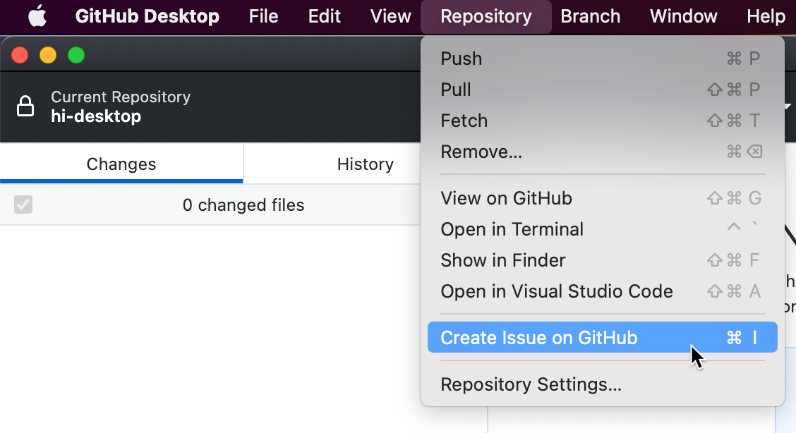
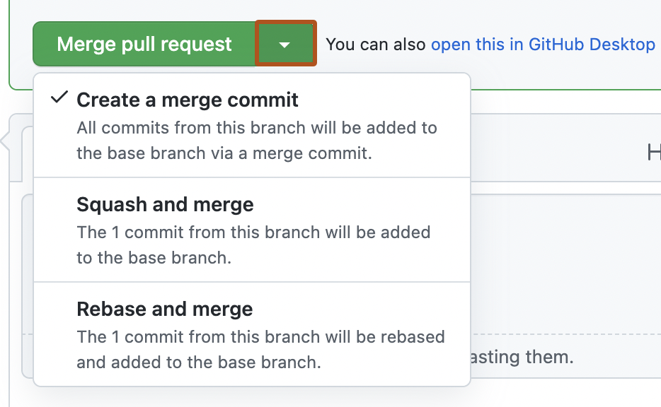

# 6. Zusammenarbeit auf GitHub

## Grundlagen der Zusammenarbeit



### Video-Tutorial: Pull Requests
[Github Tutorial - Pull-Requests (Deutsch/German)](https://www.youtube.com/watch?v=l8MZCnrSeQQ)

Die Zusammenarbeit ist ein zentraler Aspekt von GitHub und einer der Hauptgründe für seinen Erfolg. GitHub bietet verschiedene Werkzeuge und Funktionen, die es Entwicklern ermöglichen, effektiv zusammenzuarbeiten, unabhängig davon, ob sie im selben Büro sitzen oder über die ganze Welt verteilt sind.

### Kollaborationsmodelle

Es gibt verschiedene Modelle der Zusammenarbeit auf GitHub, die je nach Projektgröße, Teamstruktur und Zugriffsrechten geeignet sein können:

**Shared Repository-Modell**:
Beim Shared Repository-Modell haben alle Mitwirkenden direkten Schreibzugriff auf das Repository. Dieses Modell ist typisch für Teams, die bereits zusammenarbeiten, wie Unternehmensteams oder kleine Gruppen von Entwicklern. Die Zusammenarbeit erfolgt in der Regel über Feature-Branches und Pull Requests innerhalb desselben Repositories.

Vorteile:
- Einfachere Verwaltung von Berechtigungen
- Direkter Zugriff auf alle Branches und Issues
- Vereinfachte Kommunikation innerhalb des Teams

**Fork and Pull-Modell**:
Beim Fork and Pull-Modell erstellt jeder Mitwirkende einen eigenen Fork (eine Kopie) des Haupt-Repositories und nimmt Änderungen daran vor. Wenn die Änderungen bereit sind, erstellt der Mitwirkende einen Pull Request, um seine Änderungen in das Haupt-Repository zu integrieren. Dieses Modell ist typisch für Open-Source-Projekte mit vielen externen Beitragenden.

Vorteile:
- Klare Trennung zwischen offiziellen und Beitrags-Repositories
- Projektbetreuer behalten volle Kontrolle über das Haupt-Repository
- Ermöglicht Beiträge von jedem, ohne direkten Schreibzugriff zu gewähren

### Rollen und Berechtigungen

GitHub bietet verschiedene Rollen und Berechtigungsstufen, um die Zusammenarbeit zu strukturieren und zu sichern:

**Für persönliche Repositories**:
- **Besitzer**: Hat vollständige administrative Kontrolle über das Repository
- **Mitarbeiter**: Kann Änderungen pushen und Branches verwalten, aber keine administrativen Änderungen vornehmen
- **Externe Mitwirkende**: Können Pull Requests erstellen, haben aber keinen direkten Schreibzugriff

**Für Organisations-Repositories**:
- **Besitzer**: Hat vollständige administrative Kontrolle über alle Repositories der Organisation
- **Mitglieder**: Haben Zugriff auf Repositories basierend auf Team-Zugehörigkeit und spezifischen Berechtigungen
- **Teams**: Gruppen von Mitgliedern mit gemeinsamen Berechtigungen für bestimmte Repositories

**Repository-spezifische Berechtigungen**:
- **Read**: Kann das Repository anzeigen und klonen
- **Triage**: Kann Issues und Pull Requests verwalten, ohne Code zu ändern
- **Write**: Kann Code pushen und Branches verwalten
- **Maintain**: Kann Repositories verwalten, ohne Zugriff auf sensible oder destruktive Aktionen zu haben
- **Admin**: Hat vollständige Kontrolle über das Repository

Die richtige Konfiguration von Rollen und Berechtigungen ist entscheidend für eine sichere und effektive Zusammenarbeit, insbesondere in größeren Teams oder bei öffentlichen Projekten.

### Kommunikation und Transparenz

Effektive Kommunikation ist der Schlüssel zur erfolgreichen Zusammenarbeit. GitHub bietet verschiedene Werkzeuge, um die Kommunikation zu erleichtern:

**Issues**: Issues dienen als Diskussionsplattform für Fehler, Funktionsanfragen und andere projektbezogene Themen. Sie ermöglichen es, Aufgaben zu verfolgen, Prioritäten zu setzen und den Fortschritt zu überwachen.

**Pull Requests**: Pull Requests sind nicht nur ein Werkzeug zum Zusammenführen von Code, sondern auch ein Ort für Code-Reviews und Diskussionen über spezifische Änderungen.

**Projektboards**: Projektboards bieten eine visuelle Übersicht über den Fortschritt von Issues und Pull Requests und helfen, die Arbeit zu organisieren und zu priorisieren.

**Wikis**: Wikis ermöglichen es, umfangreiche Dokumentation zu erstellen und zu pflegen, die für alle Teammitglieder zugänglich ist.

**Discussions**: GitHub Discussions bietet einen Raum für allgemeine Diskussionen, Fragen und Antworten sowie Community-Engagement, der über den Rahmen von Issues hinausgeht.

Transparenz ist ein weiterer wichtiger Aspekt der Zusammenarbeit auf GitHub. Durch öffentliche Repositories, klare Dokumentation und offene Kommunikation können Teams effektiver zusammenarbeiten und Vertrauen aufbauen.

## Pull Requests und Code Reviews

Pull Requests (PRs) und Code Reviews sind zentrale Elemente der Zusammenarbeit auf GitHub. Sie ermöglichen es, Änderungen vorzuschlagen, zu diskutieren und zu überprüfen, bevor sie in den Hauptcode integriert werden.

### Erstellen eines Pull Requests

Ein Pull Request ist eine Anfrage, Änderungen aus einem Branch in einen anderen zu übernehmen. Der typische Workflow zum Erstellen eines Pull Requests umfasst folgende Schritte:

1. **Branch erstellen**: Erstellen Sie einen neuen Branch für Ihre Änderungen:
   ```
   git checkout -b feature/neue-funktion
   ```

2. **Änderungen vornehmen**: Nehmen Sie Ihre Änderungen vor und committen Sie sie:
   ```
   git add .
   git commit -m "Füge neue Funktion hinzu"
   ```

3. **Branch pushen**: Pushen Sie Ihren Branch zu GitHub:
   ```
   git push origin feature/neue-funktion
   ```

4. **Pull Request erstellen**: Navigieren Sie auf GitHub zu Ihrem Repository und klicken Sie auf "Compare & pull request". Alternativ können Sie zur Registerkarte "Pull requests" navigieren und auf "New pull request" klicken.

5. **Pull Request konfigurieren**:
   - Wählen Sie den Basis-Branch (normalerweise `main` oder `master`) und Ihren Feature-Branch
   - Geben Sie einen aussagekräftigen Titel ein
   - Schreiben Sie eine detaillierte Beschreibung Ihrer Änderungen
   - Verknüpfen Sie relevante Issues (z.B. "Fixes #123")
   - Weisen Sie Reviewer zu
   - Fügen Sie Labels, Meilensteine oder Projekte hinzu
   - Klicken Sie auf "Create pull request"

### Pull Request-Templates



Pull Request-Templates sind vordefinierte Vorlagen, die automatisch in die Beschreibung eines neuen Pull Requests eingefügt werden. Sie helfen, konsistente und vollständige Informationen zu gewährleisten und den Review-Prozess zu erleichtern.

Um ein Pull Request-Template zu erstellen:

1. Erstellen Sie eine Datei namens `PULL_REQUEST_TEMPLATE.md` im Stammverzeichnis Ihres Repositories oder im Verzeichnis `.github/`

2. Fügen Sie den gewünschten Inhalt hinzu, z.B.:
   ```markdown
   ## Beschreibung
   Bitte beschreiben Sie Ihre Änderungen und den Kontext.

   ## Art der Änderung
   - [ ] Bugfix
   - [ ] Neue Funktion
   - [ ] Breaking Change
   - [ ] Dokumentation

   ## Wie wurde getestet?
   Bitte beschreiben Sie die Tests, die Sie durchgeführt haben.

   ## Checkliste
   - [ ] Mein Code folgt dem Stil dieses Projekts
   - [ ] Ich habe die Dokumentation aktualisiert
   - [ ] Meine Änderungen erzeugen keine neuen Warnungen
   - [ ] Ich habe Tests hinzugefügt, die meine Änderungen belegen
   - [ ] Alle neuen und bestehenden Tests bestehen
   ```

3. Committen und pushen Sie die Datei zu Ihrem Repository

Bei jedem neuen Pull Request wird diese Vorlage automatisch in die Beschreibung eingefügt, was den Prozess standardisiert und sicherstellt, dass alle wichtigen Informationen enthalten sind.

### Effektive Code Reviews durchführen

Code Reviews sind ein wesentlicher Bestandteil des Pull Request-Prozesses. Sie verbessern die Codequalität, fördern Wissensaustausch und helfen, Fehler frühzeitig zu erkennen.

**Richtlinien für Reviewer**:

1. **Sei respektvoll und konstruktiv**: Konzentrieren Sie sich auf den Code, nicht auf die Person. Geben Sie konstruktives Feedback und erklären Sie, warum etwas geändert werden sollte.

2. **Sei gründlich, aber fokussiert**: Überprüfen Sie den Code sorgfältig, aber konzentrieren Sie sich auf wichtige Aspekte wie Funktionalität, Sicherheit, Leistung und Wartbarkeit.

3. **Stelle Fragen statt Anweisungen zu geben**: Fragen wie "Hast du darüber nachgedacht, X zu verwenden?" sind oft effektiver als Anweisungen wie "Verwende X stattdessen".

4. **Loben Sie guten Code**: Heben Sie positive Aspekte hervor, nicht nur Probleme.

5. **Priorisieren Sie Feedback**: Unterscheiden Sie zwischen kritischen Problemen, die behoben werden müssen, und Vorschlägen zur Verbesserung.

**Richtlinien für Autoren**:

1. **Bereiten Sie Ihren Code vor**: Stellen Sie sicher, dass Ihr Code vollständig, getestet und dokumentiert ist, bevor Sie einen Review anfordern.

2. **Beschreiben Sie Ihre Änderungen klar**: Erklären Sie, was Sie geändert haben, warum Sie es geändert haben und wie es getestet wurde.

3. **Reagieren Sie auf Feedback**: Nehmen Sie Feedback ernst und reagieren Sie zeitnah darauf. Wenn Sie mit einem Vorschlag nicht einverstanden sind, erklären Sie Ihre Gründe respektvoll.

4. **Iterieren Sie bei Bedarf**: Seien Sie bereit, Ihren Code basierend auf Feedback zu überarbeiten und erneut zur Überprüfung einzureichen.

### Pull Request-Workflow

Ein typischer Pull Request-Workflow umfasst folgende Schritte:

1. **Erstellung**: Der Autor erstellt einen Pull Request mit einer klaren Beschreibung der Änderungen.

2. **Review-Anforderung**: Der Autor fordert Reviews von relevanten Teammitgliedern an.

3. **Automatisierte Checks**: CI/CD-Pipelines führen automatisierte Tests und Überprüfungen durch.

4. **Code Review**: Reviewer überprüfen den Code und hinterlassen Kommentare, Vorschläge oder Genehmigungen.

5. **Diskussion und Iteration**: Der Autor beantwortet Fragen, nimmt Änderungen vor und pusht weitere Commits in den Branch.

6. **Genehmigung**: Sobald alle erforderlichen Reviews und Checks bestanden sind, wird der Pull Request genehmigt.

7. **Zusammenführen**: Der Pull Request wird in den Zielbranch zusammengeführt, entweder durch den Autor oder einen Projektbetreuer.

8. **Branch-Bereinigung**: Der Feature-Branch wird gelöscht, um das Repository aufgeräumt zu halten.

Dieser Workflow kann je nach Teamgröße, Projektkomplexität und Entwicklungsprozess variieren, aber die Grundprinzipien bleiben gleich: Vorschlagen, Überprüfen, Diskutieren und Integrieren von Änderungen auf kollaborative Weise.

## Arbeiten mit Issues

Issues sind ein leistungsstarkes Werkzeug zur Verfolgung von Aufgaben, Fehlern und Funktionsanfragen in GitHub-Projekten. Sie bilden die Grundlage für die Projektplanung und -verwaltung.

### Effektive Issues erstellen

Ein gut geschriebenes Issue enthält alle Informationen, die notwendig sind, um das Problem zu verstehen und zu lösen. Hier sind einige Richtlinien für die Erstellung effektiver Issues:

1. **Aussagekräftiger Titel**: Der Titel sollte kurz und präzise sein und das Hauptproblem oder die Aufgabe beschreiben.

2. **Detaillierte Beschreibung**: Die Beschreibung sollte folgende Elemente enthalten:
   - Kontext: Hintergrundinformationen zum Issue
   - Problem oder Anforderung: Was genau ist das Problem oder was soll erreicht werden?
   - Reproduktionsschritte (bei Fehlern): Wie kann das Problem reproduziert werden?
   - Erwartetes vs. tatsächliches Verhalten (bei Fehlern): Was sollte passieren und was passiert stattdessen?
   - Umgebungsinformationen: Betriebssystem, Browser, Versionen etc.
   - Screenshots oder Videos: Visuelle Darstellungen des Problems, falls zutreffend

3. **Labels**: Verwenden Sie Labels, um das Issue zu kategorisieren (z.B. bug, enhancement, documentation).

4. **Meilensteine**: Weisen Sie das Issue einem Meilenstein zu, um es mit einem bestimmten Release oder Sprint zu verknüpfen.

5. **Assignees**: Weisen Sie das Issue einer oder mehreren Personen zu, die daran arbeiten sollen.

6. **Verknüpfungen**: Verknüpfen Sie das Issue mit verwandten Issues oder Pull Requests.

### Issue-Templates

Ähnlich wie bei Pull Request-Templates können auch für Issues Templates erstellt werden, um konsistente und vollständige Informationen zu gewährleisten.

Um Issue-Templates zu erstellen:

1. Erstellen Sie ein Verzeichnis `.github/ISSUE_TEMPLATE/` in Ihrem Repository

2. Erstellen Sie Markdown-Dateien für verschiedene Issue-Typen, z.B. `bug_report.md`, `feature_request.md`, `documentation.md`

3. Fügen Sie den gewünschten Inhalt hinzu, z.B. für `bug_report.md`:
   ```markdown
   ---
   name: Bug Report
   about: Erstellen Sie einen Bericht, um uns bei der Verbesserung zu helfen
   title: '[BUG] '
   labels: bug
   assignees: ''
   ---

   ## Beschreibung des Fehlers
   Eine klare und präzise Beschreibung des Fehlers.

   ## Reproduktionsschritte
   Schritte, um das Verhalten zu reproduzieren:
   1. Gehen Sie zu '...'
   2. Klicken Sie auf '....'
   3. Scrollen Sie nach unten zu '....'
   4. Sehen Sie den Fehler

   ## Erwartetes Verhalten
   Eine klare und präzise Beschreibung dessen, was Sie erwartet haben.

   ## Screenshots
   Falls zutreffend, fügen Sie Screenshots hinzu, um Ihr Problem zu erklären.

   ## Umgebung
   - Betriebssystem: [z.B. Windows 10]
   - Browser: [z.B. Chrome 91.0]
   - Version: [z.B. 1.2.3]

   ## Zusätzlicher Kontext
   Fügen Sie hier weiteren Kontext zum Problem hinzu.
   ```

4. Committen und pushen Sie die Dateien zu Ihrem Repository

Wenn Benutzer nun ein neues Issue erstellen, können sie aus den verfügbaren Templates wählen, was den Prozess standardisiert und die Qualität der Issues verbessert.

### Issues organisieren und verwalten

Mit zunehmender Anzahl von Issues wird deren Organisation und Verwaltung immer wichtiger. Hier sind einige Strategien:

**Labels verwenden**:
Labels sind farbige Tags, die helfen, Issues zu kategorisieren und zu filtern. Typische Labels sind:
- `bug`: Fehler im Code
- `enhancement`: Neue Funktionen oder Verbesserungen
- `documentation`: Dokumentationsbezogene Issues
- `good first issue`: Einfache Issues für neue Beitragende
- `help wanted`: Issues, bei denen Hilfe benötigt wird
- `priority: high/medium/low`: Prioritätsstufen

Sie können auch benutzerdefinierte Labels erstellen, die spezifisch für Ihr Projekt sind.

**Meilensteine verwenden**:
Meilensteine gruppieren Issues für bestimmte Ziele oder Zeiträume, wie Releases oder Sprints. Sie haben ein optionales Fälligkeitsdatum und zeigen den Fortschritt anhand der abgeschlossenen Issues an.

**Projektboards verwenden**:
Projektboards bieten eine visuelle Kanban-ähnliche Oberfläche zur Verwaltung von Issues. Sie können Spalten wie "To Do", "In Progress" und "Done" erstellen und Issues zwischen ihnen verschieben.

**Issues schließen**:
Wenn ein Issue gelöst ist, sollte es geschlossen werden. Dies kann manuell erfolgen oder automatisch durch einen Pull Request mit Schlüsselwörtern wie "Fixes #123" oder "Closes #123" in der Commit-Nachricht oder PR-Beschreibung.

**Issues filtern und suchen**:
GitHub bietet leistungsstarke Filter- und Suchfunktionen für Issues:
- `is:open`: Nur offene Issues anzeigen
- `is:closed`: Nur geschlossene Issues anzeigen
- `label:bug`: Issues mit dem Label "bug"
- `assignee:username`: Issues, die einem bestimmten Benutzer zugewiesen sind
- `milestone:v1.0`: Issues für einen bestimmten Meilenstein
- `mentions:username`: Issues, die einen bestimmten Benutzer erwähnen
- `created:>2023-01-01`: Issues, die nach einem bestimmten Datum erstellt wurden

Diese Filter können kombiniert werden, um komplexe Abfragen zu erstellen.

### Issue-Diskussionen und Entscheidungsfindung

Issues sind nicht nur zum Verfolgen von Aufgaben da, sondern auch für Diskussionen und Entscheidungsfindung. Hier sind einige Best Practices:

1. **Klare Kommunikation**: Drücken Sie Ihre Gedanken klar und präzise aus. Verwenden Sie Markdown-Formatierung, um Ihre Beiträge zu strukturieren.

2. **Respektvolle Diskussion**: Bleiben Sie respektvoll und konstruktiv, auch bei Meinungsverschiedenheiten. Konzentrieren Sie sich auf Ideen, nicht auf Personen.

3. **Entscheidungen dokumentieren**: Wenn eine Entscheidung getroffen wird, dokumentieren Sie sie klar im Issue, damit sie für zukünftige Referenz verfügbar ist.

4. **Zusammenfassungen erstellen**: Bei langen Diskussionen kann es hilfreich sein, gelegentlich Zusammenfassungen zu erstellen, um den aktuellen Stand festzuhalten.

5. **Reaktionen verwenden**: Verwenden Sie GitHub-Reaktionen (👍, 👎, 😄, etc.), um Zustimmung oder Ablehnung auszudrücken, ohne redundante Kommentare zu hinterlassen.

6. **Referenzen verwenden**: Verknüpfen Sie verwandte Issues, Pull Requests oder externe Ressourcen, um Kontext zu bieten.

Issues sind ein zentrales Element der Zusammenarbeit auf GitHub und bilden die Grundlage für transparente, nachvollziehbare Projektentwicklung.

## Zusammenarbeit in Teams

Die Zusammenarbeit in Teams auf GitHub erfordert Struktur, Koordination und klare Prozesse. GitHub bietet verschiedene Funktionen, die speziell für die Teamarbeit entwickelt wurden.

### Organisationen und Teams einrichten

**Organisationen** sind gemeinsame Konten auf GitHub, die mehrere Projekte und Benutzer unter einem Dach vereinen. Sie sind ideal für Unternehmen, Open-Source-Projekte oder andere Gruppen, die gemeinsam an mehreren Repositories arbeiten.

Um eine Organisation zu erstellen:
1. Klicken Sie auf Ihr Profilbild und wählen Sie "Your organizations"
2. Klicken Sie auf "New organization"
3. Wählen Sie einen Plan und geben Sie den Namen und die Kontakt-E-Mail ein
4. Fügen Sie Mitglieder hinzu und konfigurieren Sie deren Berechtigungen

**Teams** sind Gruppen von Organisationsmitgliedern mit spezifischen Berechtigungen für bestimmte Repositories. Sie ermöglichen eine feinere Kontrolle über den Zugriff und erleichtern die Kommunikation innerhalb von Untergruppen.

Um Teams zu erstellen und zu verwalten:
1. Navigieren Sie zur Registerkarte "Teams" in Ihrer Organisation
2. Klicken Sie auf "New team"
3. Geben Sie einen Namen, eine Beschreibung und eine Sichtbarkeit ein
4. Fügen Sie Mitglieder hinzu
5. Weisen Sie dem Team Repositories und Berechtigungen zu

Teams können auch hierarchisch organisiert werden, mit übergeordneten und untergeordneten Teams, um die Organisationsstruktur abzubilden.

### Zugriffsrechte und Berechtigungen verwalten

Die richtige Konfiguration von Zugriffsrechten ist entscheidend für die Sicherheit und Effizienz der Zusammenarbeit:

**Organisationsrollen**:
- **Besitzer**: Haben vollständige administrative Kontrolle über die Organisation
- **Mitglieder**: Haben eingeschränkten Zugriff, basierend auf Team-Zugehörigkeit und spezifischen Berechtigungen

**Team-Berechtigungen für Repositories**:
- **Read**: Kann das Repository anzeigen und klonen
- **Triage**: Kann Issues und Pull Requests verwalten, ohne Code zu ändern
- **Write**: Kann Code pushen und Branches verwalten
- **Maintain**: Kann Repositories verwalten, ohne Zugriff auf sensible oder destruktive Aktionen zu haben
- **Admin**: Hat vollständige Kontrolle über das Repository

**Branch-Schutzregeln**:
Branch-Schutzregeln sind besonders wichtig für die Teamarbeit, da sie sicherstellen, dass wichtige Branches (wie `main`) nur unter bestimmten Bedingungen geändert werden können:
1. Navigieren Sie zu "Settings" > "Branches" > "Branch protection rules"
2. Konfigurieren Sie Regeln wie:
   - Erforderliche Reviews vor dem Zusammenführen
   - Erforderliche Statusprüfungen
   - Erforderliche signierte Commits
   - Einschränkungen, wer pushen kann

### Workflows für Teamarbeit

Effektive Teamarbeit erfordert klare Workflows, die den Entwicklungsprozess strukturieren und Konflikte minimieren:

**GitHub Flow**:
GitHub Flow ist ein einfacher, branchbasierter Workflow:
1. Erstellen Sie einen Branch von `main` für jede neue Funktion oder Fehlerbehebung
2. Nehmen Sie Änderungen vor und committen Sie regelmäßig
3. Öffnen Sie einen Pull Request, wenn Sie bereit sind
4. Diskutieren und überprüfen Sie den Code
5. Führen Sie den Branch in `main` zusammen, wenn alles in Ordnung ist
6. Stellen Sie den Code bereit

**Trunk-Based Development**:
Bei Trunk-Based Development arbeiten alle Entwickler an kurzen Branches, die schnell in den Hauptbranch integriert werden:
1. Erstellen Sie kurzlebige Feature-Branches (1-2 Tage)
2. Integrieren Sie Änderungen häufig in den Hauptbranch
3. Verwenden Sie Feature Flags für unvollständige Funktionen
4. Setzen Sie stark auf automatisierte Tests und CI/CD

**Release-Branching**:
Für Projekte mit formellen Releases kann ein Release-Branching-Workflow geeignet sein:
1. Entwickeln Sie in Feature-Branches
2. Führen Sie Feature-Branches in `develop` zusammen
3. Erstellen Sie einen Release-Branch, wenn ein Release vorbereitet wird
4. Stabilisieren Sie den Release-Branch durch Fehlerbehebungen
5. Führen Sie den Release-Branch in `main` zusammen und taggen Sie die Version
6. Führen Sie Fehlerbehebungen zurück in `develop`

Die Wahl des Workflows hängt von der Teamgröße, der Projektart und den Anforderungen an Stabilität und Release-Häufigkeit ab.

### Kommunikation und Dokumentation

Effektive Kommunikation und Dokumentation sind entscheidend für erfolgreiche Teamarbeit:

**README-Dateien**:
Jedes Repository sollte eine umfassende README-Datei haben, die das Projekt beschreibt, Installationsanweisungen enthält und erklärt, wie man beitragen kann.

**Wikis**:
GitHub Wikis bieten Raum für ausführlichere Dokumentation, wie Architekturübersichten, API-Referenzen oder Benutzerhandbücher.

**Diskussionen**:
GitHub Discussions ermöglicht es Teams, Fragen zu stellen, Ideen zu diskutieren und Wissen zu teilen, ohne formelle Issues zu erstellen.

**Projektboards**:
Projektboards bieten eine visuelle Übersicht über den Fortschritt und helfen, die Arbeit zu koordinieren.

**Team-Mentions**:
Teams können mit @team-name erwähnt werden, um alle Mitglieder zu benachrichtigen.

**Pull Request-Reviews**:
Code Reviews sind nicht nur für die Codequalität wichtig, sondern auch für den Wissensaustausch und die Teamkommunikation.

**Commit-Nachrichten und PR-Beschreibungen**:
Klare, informative Commit-Nachrichten und PR-Beschreibungen dokumentieren, warum und wie Änderungen vorgenommen wurden.

### Konfliktlösung und Entscheidungsfindung

In jedem Team können Konflikte und Meinungsverschiedenheiten auftreten. GitHub bietet Werkzeuge, die bei der Lösung helfen können:

**Issue-Diskussionen**:
Issues bieten einen strukturierten Raum für Diskussionen über spezifische Probleme oder Funktionen.

**Pull Request-Reviews**:
Reviews ermöglichen es, Feedback zu geben und zu diskutieren, bevor Änderungen zusammengeführt werden.

**Reaktionen und Kommentare**:
GitHub-Reaktionen (👍, 👎, etc.) können verwendet werden, um schnell Zustimmung oder Ablehnung auszudrücken.

**Entscheidungsdokumentation**:
Wichtige Entscheidungen sollten in Issues oder Pull Requests dokumentiert werden, mit klaren Begründungen und Kontext.

**Governance-Modelle**:
Für größere Projekte kann es hilfreich sein, formelle Governance-Modelle zu etablieren, die festlegen, wie Entscheidungen getroffen werden (z.B. Konsens, Mehrheitsentscheidung, Benevolent Dictator).

**Code of Conduct**:
Ein Code of Conduct legt Verhaltensregeln fest und schafft einen respektvollen Rahmen für die Zusammenarbeit.

Die Kombination aus klaren Prozessen, effektiver Kommunikation und respektvollem Umgang miteinander bildet die Grundlage für erfolgreiche Teamarbeit auf GitHub.

## Beitragen zu Open-Source-Projekten

Das Beitragen zu Open-Source-Projekten ist eine großartige Möglichkeit, Ihre Fähigkeiten zu verbessern, von anderen zu lernen und der Entwicklergemeinschaft etwas zurückzugeben. GitHub ist die Heimat von Millionen von Open-Source-Projekten, zu denen Sie beitragen können.

### Ein Projekt finden und verstehen

Der erste Schritt beim Beitragen zu Open-Source ist, ein Projekt zu finden, das zu Ihren Interessen und Fähigkeiten passt:

1. **Erkunden Sie GitHub**: Verwenden Sie die Suchfunktion oder die Explore-Seite, um Projekte zu finden. Filter nach Sprache, Thema oder Beliebtheit.

2. **Folgen Sie Ihren Interessen**: Wählen Sie Projekte in Bereichen, die Sie interessieren oder mit Technologien, die Sie lernen möchten.

3. **Beginnen Sie klein**: Für Anfänger ist es oft besser, mit kleineren Projekten oder gut dokumentierten größeren Projekten zu beginnen.

4. **Suchen Sie nach "good first issues"**: Viele Projekte kennzeichnen einfache Issues als "good first issue" oder "beginner friendly".

Sobald Sie ein Projekt gefunden haben, ist es wichtig, es zu verstehen, bevor Sie beitragen:

1. **Lesen Sie die README**: Die README-Datei enthält in der Regel eine Übersicht über das Projekt, seine Ziele und grundlegende Nutzungsinformationen.

2. **Überprüfen Sie die CONTRIBUTING-Datei**: Viele Projekte haben eine CONTRIBUTING.md-Datei, die spezifische Richtlinien für Beiträge enthält.

3. **Verstehen Sie den Code of Conduct**: Der Code of Conduct legt die Verhaltensregeln für die Projektgemeinschaft fest.

4. **Erkunden Sie die Issues**: Aktuelle Issues geben Einblick in die Probleme und Funktionen, an denen das Projekt arbeitet.

5. **Sehen Sie sich Pull Requests an**: Bestehende PRs zeigen, wie Beiträge strukturiert und überprüft werden.

6. **Verstehen Sie die Projektstruktur**: Nehmen Sie sich Zeit, die Codebasis zu verstehen, bevor Sie Änderungen vornehmen.

### Erste Beiträge leisten

Nachdem Sie ein Projekt verstanden haben, können Sie mit Ihren ersten Beiträgen beginnen:

1. **Fork des Repositories**: Erstellen Sie einen Fork des Projekts in Ihrem eigenen GitHub-Konto.

2. **Klonen Sie Ihren Fork**: Klonen Sie den Fork auf Ihren lokalen Computer:
   ```
   git clone https://github.com/ihr-benutzername/repository-name.git
   ```

3. **Upstream-Remote hinzufügen**: Fügen Sie das Original-Repository als "upstream" hinzu, um Änderungen synchronisieren zu können:
   ```
   git remote add upstream https://github.com/original-owner/repository-name.git
   ```

4. **Branch erstellen**: Erstellen Sie einen neuen Branch für Ihre Änderungen:
   ```
   git checkout -b feature/ihre-funktion
   ```

5. **Änderungen vornehmen**: Nehmen Sie Ihre Änderungen vor und committen Sie sie mit klaren, beschreibenden Commit-Nachrichten.

6. **Synchronisieren Sie mit Upstream**: Holen Sie regelmäßig Änderungen vom Upstream-Repository:
   ```
   git fetch upstream
   git rebase upstream/main
   ```

7. **Pushen Sie Ihre Änderungen**: Pushen Sie Ihren Branch zu Ihrem Fork:
   ```
   git push origin feature/ihre-funktion
   ```

8. **Pull Request erstellen**: Navigieren Sie zu Ihrem Fork auf GitHub und klicken Sie auf "Compare & pull request". Folgen Sie den Richtlinien des Projekts für PR-Beschreibungen.

### Effektive Pull Requests erstellen

Ein guter Pull Request erhöht die Wahrscheinlichkeit, dass Ihre Beiträge akzeptiert werden:

1. **Fokussieren Sie sich auf eine Änderung**: Jeder PR sollte eine einzelne, zusammenhängende Änderung enthalten. Vermeiden Sie es, mehrere unabhängige Änderungen in einem PR zu kombinieren.

2. **Folgen Sie den Projektrichtlinien**: Beachten Sie die Coding-Standards, Commit-Nachrichtenformate und andere Richtlinien des Projekts.

3. **Schreiben Sie eine klare PR-Beschreibung**: Erklären Sie, was Ihre Änderungen bewirken, warum sie notwendig sind und wie sie implementiert wurden.

4. **Verknüpfen Sie relevante Issues**: Wenn Ihr PR ein bestimmtes Issue löst, verknüpfen Sie es mit Schlüsselwörtern wie "Fixes #123".

5. **Fügen Sie Tests hinzu**: Wenn möglich, fügen Sie Tests hinzu, die Ihre Änderungen abdecken.

6. **Aktualisieren Sie die Dokumentation**: Wenn Ihre Änderungen das Verhalten oder die API des Projekts ändern, aktualisieren Sie die entsprechende Dokumentation.

7. **Halten Sie Ihren PR aktuell**: Wenn der Hauptbranch des Projekts aktualisiert wird, rebasen Sie Ihren Branch, um Konflikte zu vermeiden.

8. **Seien Sie geduldig und respektvoll**: Open-Source-Betreuer sind oft beschäftigt. Seien Sie geduldig und reagieren Sie respektvoll auf Feedback.

### Mit der Community interagieren

Die Interaktion mit der Projektgemeinschaft ist ein wichtiger Aspekt des Open-Source-Beitragens:

1. **Stellen Sie Fragen**: Wenn Sie unsicher sind, stellen Sie Fragen in Issues, Diskussionen oder Community-Kanälen wie Slack oder Discord.

2. **Geben Sie konstruktives Feedback**: Kommentieren Sie Issues und PRs anderer Beitragender mit konstruktivem Feedback.

3. **Helfen Sie anderen**: Beantworten Sie Fragen in Diskussionen oder Issues, besonders wenn Sie bereits Erfahrung mit dem Projekt haben.

4. **Seien Sie respektvoll**: Respektieren Sie unterschiedliche Meinungen und Hintergründe. Folgen Sie dem Code of Conduct des Projekts.

5. **Akzeptieren Sie Feedback**: Seien Sie offen für Feedback zu Ihren Beiträgen und bereit, Änderungen vorzunehmen.

6. **Bauen Sie Beziehungen auf**: Langfristige Beiträge und Beziehungen zu anderen Beitragenden können zu tieferem Engagement und möglicherweise zu einer Maintainer-Rolle führen.

### Langfristiges Engagement

Wenn Sie sich langfristig für ein Projekt engagieren möchten:

1. **Bleiben Sie konsistent**: Regelmäßige kleine Beiträge sind oft wertvoller als sporadische große Änderungen.

2. **Übernehmen Sie Verantwortung**: Bieten Sie an, bestimmte Bereiche des Projekts zu betreuen oder regelmäßig bestimmte Aufgaben zu übernehmen.

3. **Helfen Sie bei der Dokumentation**: Dokumentation ist oft ein vernachlässigter Bereich, in dem Hilfe sehr geschätzt wird.

4. **Überprüfen Sie Pull Requests**: Helfen Sie den Maintainern, indem Sie PRs anderer Beitragender überprüfen.

5. **Beteiligen Sie sich an Diskussionen**: Nehmen Sie an strategischen Diskussionen über die Zukunft des Projekts teil.

6. **Fördern Sie das Projekt**: Sprechen Sie über das Projekt auf Konferenzen, in Blogbeiträgen oder sozialen Medien.

Das Beitragen zu Open-Source-Projekten kann eine lohnende Erfahrung sein, die Ihre technischen Fähigkeiten verbessert, Ihr berufliches Netzwerk erweitert und Ihnen die Möglichkeit gibt, an Projekten mitzuarbeiten, die Sie nutzen und schätzen.

## GitHub Discussions und Community-Aufbau

GitHub Discussions ist eine Funktion, die über Issues und Pull Requests hinausgeht und einen Raum für offene Gespräche, Fragen und Antworten sowie Community-Engagement bietet. Sie ist besonders nützlich für den Aufbau einer aktiven und engagierten Community rund um Ihr Projekt.

### GitHub Discussions einrichten und nutzen

Um GitHub Discussions für Ihr Repository zu aktivieren:

1. Navigieren Sie zu Ihrem Repository auf GitHub
2. Klicken Sie auf "Settings" (Einstellungen)
3. Scrollen Sie nach unten zum Abschnitt "Features"
4. Aktivieren Sie das Kontrollkästchen neben "Discussions"
5. Klicken Sie auf "Save" (Speichern)

Nach der Aktivierung erscheint eine neue Registerkarte "Discussions" in Ihrem Repository. Hier können Sie Diskussionen in verschiedenen Kategorien erstellen und verwalten.

**Diskussionskategorien**:
GitHub bietet standardmäßig einige Kategorien an, die Sie anpassen können:
- **Announcements** (Ankündigungen): Wichtige Updates und Neuigkeiten
- **General** (Allgemein): Allgemeine Diskussionen über das Projekt
- **Ideas** (Ideen): Vorschläge für neue Funktionen oder Verbesserungen
- **Q&A** (Fragen und Antworten): Fragen zur Nutzung des Projekts
- **Show and tell** (Zeigen und Erzählen): Teilen von Projekten oder Anwendungsfällen

Sie können diese Kategorien bearbeiten oder neue hinzufügen, um sie an die Bedürfnisse Ihres Projekts anzupassen.

**Diskussionen erstellen und moderieren**:
1. Klicken Sie auf "New discussion" (Neue Diskussion)
2. Wählen Sie eine Kategorie
3. Geben Sie einen Titel und eine Beschreibung ein
4. Verwenden Sie Markdown zur Formatierung
5. Klicken Sie auf "Start discussion" (Diskussion starten)

Als Repository-Betreuer können Sie Diskussionen moderieren:
- Antworten als markiert oder nicht hilfreich kennzeichnen
- Diskussionen schließen oder wieder öffnen
- Diskussionen in andere Kategorien verschieben
- Diskussionen in Issues umwandeln
- Diskussionen anheften, um sie hervorzuheben

### Community-Richtlinien und Governance

Klare Richtlinien und Governance-Strukturen sind entscheidend für eine gesunde Community:

**Community-Richtlinien**:
Erstellen Sie eine COMMUNITY_GUIDELINES.md-Datei, die folgende Aspekte abdeckt:
- Verhaltensregeln und Erwartungen
- Kommunikationskanäle und deren Zweck
- Prozess für Beiträge und Feedback
- Entscheidungsfindungsprozesse
- Konfliktlösungsstrategien

**Code of Conduct**:
Ein Code of Conduct legt die Grundregeln für die Interaktion in der Community fest:
1. Erstellen Sie eine CODE_OF_CONDUCT.md-Datei
2. Definieren Sie akzeptables und inakzeptables Verhalten
3. Beschreiben Sie Konsequenzen bei Verstößen
4. Erklären Sie, wie Verstöße gemeldet werden können
5. Benennen Sie Ansprechpartner für Beschwerden

GitHub bietet Vorlagen für Codes of Conduct, wie den Contributor Covenant, die Sie als Ausgangspunkt verwenden können.

**Governance-Modelle**:
Je nach Projektgröße und -struktur können verschiedene Governance-Modelle geeignet sein:
- **BDFL (Benevolent Dictator for Life)**: Ein einzelner Projektleiter trifft die endgültigen Entscheidungen
- **Meritokratie**: Einfluss basiert auf Beiträgen und Verdiensten
- **Konsensbasiert**: Entscheidungen erfordern breite Zustimmung
- **Komitee**: Eine gewählte Gruppe trifft Entscheidungen

Dokumentieren Sie das gewählte Governance-Modell in einer GOVERNANCE.md-Datei.

### Community-Engagement fördern

Eine aktive Community erfordert kontinuierliches Engagement und Pflege:

**Neue Mitglieder willkommen heißen**:
- Erstellen Sie eine freundliche README mit klaren Einstiegspunkten
- Bieten Sie eine CONTRIBUTING.md mit detaillierten Anweisungen
- Kennzeichnen Sie einfache Issues als "good first issue"
- Reagieren Sie schnell und freundlich auf erste Beiträge

**Regelmäßige Kommunikation**:
- Veröffentlichen Sie regelmäßige Updates über den Projektfortschritt
- Halten Sie Community-Calls oder virtuelle Meetups
- Senden Sie Newsletter oder Blog-Posts
- Teilen Sie Erfolgsgeschichten und Anwendungsfälle

**Anerkennung und Wertschätzung**:
- Danken Sie Beitragenden in Release Notes
- Führen Sie eine CONTRIBUTORS.md-Datei
- Verleihen Sie Abzeichen oder Rollen basierend auf Beiträgen
- Heben Sie besondere Beiträge in Community-Updates hervor

**Feedback einholen und umsetzen**:
- Erstellen Sie regelmäßige Umfragen zur Community-Zufriedenheit
- Bitten Sie um Feedback zu neuen Funktionen oder Änderungen
- Zeigen Sie, wie Feedback in Entscheidungen einfließt
- Passen Sie Prozesse basierend auf Community-Bedürfnissen an

### Community-Metriken und Wachstum

Um den Erfolg Ihrer Community zu messen und zu verbessern, können Sie verschiedene Metriken verfolgen:

**Aktivitätsmetriken**:
- Anzahl der aktiven Diskussionen
- Antwortrate und -zeit auf Fragen
- Anzahl der Beitragenden (neu vs. wiederkehrend)
- Pull Request-Akzeptanzrate und Bearbeitungszeit

**Wachstumsmetriken**:
- Neue Sterne und Forks
- Neue Follower und Watchers
- Wachstum der Nutzerbasis
- Erwähnungen in sozialen Medien oder Publikationen

**Gesundheitsmetriken**:
- Diversität der Beitragenden
- Verteilung der Beiträge (um Single Points of Failure zu vermeiden)
- Konfliktrate und -lösung
- Community-Zufriedenheit

GitHub bietet einige dieser Metriken in den Repository-Insights an, und es gibt Tools wie Bitergia oder CHAOSS, die tiefere Analysen ermöglichen.

**Strategien für nachhaltiges Wachstum**:
- Definieren Sie klare Rollen und Verantwortlichkeiten
- Schaffen Sie Aufstiegspfade für engagierte Mitglieder
- Delegieren Sie Verantwortung, um Burnout zu vermeiden
- Investieren Sie in Dokumentation und Onboarding
- Feiern Sie Meilensteine und Erfolge

Eine starke, engagierte Community kann ein Projekt weit über die Beiträge der ursprünglichen Entwickler hinaus tragen und seine Langlebigkeit und Relevanz sichern.

## Fazit

Die Zusammenarbeit ist das Herzstück von GitHub. Die Plattform bietet eine Vielzahl von Werkzeugen und Funktionen, die es Entwicklern ermöglichen, effektiv zusammenzuarbeiten, unabhängig von ihrem Standort oder ihrer Erfahrung. Von Pull Requests und Code Reviews über Issues und Diskussionen bis hin zu Teams und Community-Aufbau – GitHub schafft eine Umgebung, in der Zusammenarbeit gedeihen kann.

Die in diesem Kapitel behandelten Konzepte und Best Practices bilden die Grundlage für erfolgreiche Zusammenarbeit auf GitHub. Indem Sie diese Prinzipien anwenden, können Sie die Qualität Ihrer Projekte verbessern, die Effizienz Ihrer Teams steigern und lebendige Communities aufbauen.

In den folgenden Kapiteln werden wir uns mit weiteren fortgeschrittenen Funktionen von GitHub befassen, wie GitHub Actions für CI/CD, GitHub Pages für Webhosting und GitHub Security für die Absicherung Ihrer Projekte.
