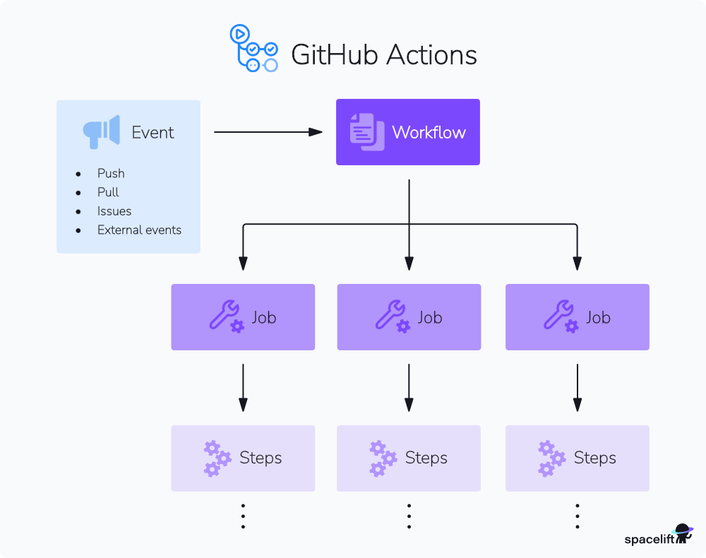

# 8. GitHub Actions und CI/CD

- [Einführung in GitHub Actions](#)
- [Workflows erstellen](#)
- [YAML-Syntax für Actions](#)
- [Vordefinierte Actions nutzen](#)
- [Eigene Actions erstellen](#)
- [Continuous Integration einrichten](#)
- [Continuous Deployment konfigurieren](#)

## Einführung in GitHub Actions


### Video-Tutorial: GitHub Actions
[Prozesse mit GitHub Actions (Deutsch)](https://www.youtube.com/watch?v=DAVJ1OGNi4o)
[GitHub Actions 001: Erste Schritte (Deutsch)](https://www.youtube.com/watch?v=H6Llov7cdOE)

GitHub Actions ist eine leistungsstarke Plattform für die Automatisierung von Software-Workflows direkt in GitHub. Es ermöglicht Entwicklern, benutzerdefinierte Workflows zu erstellen, die auf Ereignisse in ihren Repositories reagieren, wie z.B. Push-Operationen, Pull Requests, Issue-Erstellung oder geplante Ausführungen. GitHub Actions ist tief in GitHub integriert und bietet eine nahtlose Möglichkeit, kontinuierliche Integration (CI), kontinuierliche Bereitstellung (CD) und andere Automatisierungsaufgaben zu implementieren.

### Was sind GitHub Actions?

GitHub Actions ermöglicht es Ihnen, eine Vielzahl von Aufgaben zu automatisieren, die typischerweise im Softwareentwicklungszyklus anfallen:

- **Kontinuierliche Integration (CI)**: Automatisches Bauen, Testen und Überprüfen von Code bei jedem Push oder Pull Request.
- **Kontinuierliche Bereitstellung (CD)**: Automatisches Bereitstellen von Anwendungen in verschiedenen Umgebungen (Staging, Produktion) nach erfolgreichen Builds und Tests.
- **Workflow-Automatisierung**: Automatisierung von Aufgaben wie Labeling von Issues, Benachrichtigungen, Release-Management und mehr.
- **Infrastruktur-Management**: Automatisierung von Aufgaben im Zusammenhang mit der Verwaltung von Cloud-Infrastruktur oder anderen Diensten.

Die Kernidee von GitHub Actions ist es, wiederkehrende Aufgaben zu automatisieren, um Entwicklern Zeit zu sparen, die Konsistenz zu verbessern und die Qualität von Software zu erhöhen.

### Schlüsselkonzepte von GitHub Actions



Um GitHub Actions effektiv nutzen zu können, ist es wichtig, die folgenden Schlüsselkonzepte zu verstehen:

**Workflows**: Ein Workflow ist ein konfigurierbarer, automatisierter Prozess, der aus einem oder mehreren Jobs besteht. Workflows werden durch YAML-Dateien definiert, die im Verzeichnis `.github/workflows` eines Repositories gespeichert sind. Ein Repository kann mehrere Workflows haben, die jeweils auf unterschiedliche Ereignisse reagieren oder unterschiedliche Aufgaben ausführen.

**Ereignisse (Events)**: Ein Ereignis ist eine spezifische Aktivität in einem Repository, die einen Workflow auslösen kann. Beispiele für Ereignisse sind `push`, `pull_request`, `issue_comment`, `schedule` (zeitgesteuerte Ausführung) oder `workflow_dispatch` (manuelle Auslösung).

**Jobs**: Ein Job ist eine Reihe von Schritten, die auf demselben Runner ausgeführt werden. Jobs können parallel oder sequenziell ausgeführt werden. Jeder Job läuft in einer frischen virtuellen Umgebung.

**Schritte (Steps)**: Ein Schritt ist eine einzelne Aufgabe innerhalb eines Jobs. Ein Schritt kann entweder ein Shell-Skript ausführen oder eine vordefinierte Aktion verwenden.

**Aktionen (Actions)**: Aktionen sind wiederverwendbare Codeeinheiten, die komplexe Aufgaben kapseln. Es gibt Tausende von Aktionen, die von GitHub, der Community oder Ihnen selbst erstellt wurden. Aktionen können verwendet werden, um Aufgaben wie das Auschecken von Code, das Einrichten von Umgebungen, das Ausführen von Tests oder das Bereitstellen von Anwendungen zu vereinfachen.

**Runner**: Ein Runner ist ein Server, auf dem Ihre Workflows ausgeführt werden. GitHub bietet gehostete Runner für Linux, Windows und macOS an. Sie können auch eigene, selbst gehostete Runner konfigurieren, wenn Sie spezielle Hardware- oder Softwareanforderungen haben oder Ihre Workflows in Ihrem eigenen Netzwerk ausführen möchten.

### Vorteile von GitHub Actions

- **Tiefe Integration**: Nahtlose Integration in den GitHub-Workflow (Code, Issues, Pull Requests, Releases).
- **Flexibilität**: Unterstützt verschiedene Betriebssysteme, Programmiersprachen und Cloud-Plattformen.
- **Wiederverwendbarkeit**: Große Auswahl an vorgefertigten Aktionen im GitHub Marketplace.
- **Community-gesteuert**: Profitieren Sie von Aktionen und Workflows, die von der Community erstellt wurden.
- **Kosteneffizienz**: Großzügige kostenlose Kontingente für öffentliche und private Repositories.
- **Skalierbarkeit**: GitHub-gehostete Runner skalieren automatisch, um Ihre Anforderungen zu erfüllen.

## Erstellen von Workflows

Workflows sind das Herzstück von GitHub Actions. Sie definieren, wann und wie Ihre automatisierten Prozesse ausgeführt werden sollen.

### Workflow-Syntax (YAML)

Workflows werden mithilfe von YAML-Dateien definiert, die im Verzeichnis `.github/workflows` Ihres Repositories gespeichert werden. Eine typische Workflow-Datei hat folgende Struktur:

```yaml
# Name des Workflows (optional, wird in der GitHub UI angezeigt)
name: CI Workflow

# Ereignisse, die den Workflow auslösen
on:
  push:
    branches: [ main ]
  pull_request:
    branches: [ main ]

# Definition der Jobs
jobs:
  # Name des ersten Jobs
  build:
    # Betriebssystem des Runners
    runs-on: ubuntu-latest

    # Schritte innerhalb des Jobs
    steps:
      # Schritt 1: Code auschecken
      - name: Checkout code
        uses: actions/checkout@v3

      # Schritt 2: Node.js einrichten
      - name: Set up Node.js
        uses: actions/setup-node@v3
        with:
          node-version: '16'

      # Schritt 3: Abhängigkeiten installieren
      - name: Install dependencies
        run: npm ci

      # Schritt 4: Tests ausführen
      - name: Run tests
        run: npm test

  # Name des zweiten Jobs (optional)
  deploy:
    # Abhängigkeit vom ersten Job
    needs: build
    runs-on: ubuntu-latest
    # Bedingung für die Ausführung (z.B. nur bei Push auf main)
    if: github.event_name == 'push' && github.ref == 'refs/heads/main'
    steps:
      - name: Deploy to production
        run: echo "Deploying to production..."
        # Hier würden die tatsächlichen Deployment-Schritte stehen
```

**Wichtige YAML-Schlüsselwörter**:

- `name`: Der Name des Workflows.
- `on`: Definiert die auslösenden Ereignisse.
- `jobs`: Enthält die Definitionen der Jobs.
- `job_id`: Ein eindeutiger Bezeichner für einen Job.
- `runs-on`: Gibt den Typ des Runners an (z.B. `ubuntu-latest`, `windows-latest`, `macos-latest`).
- `steps`: Eine Liste von Schritten innerhalb eines Jobs.
- `name` (innerhalb von `steps`): Ein optionaler Name für einen Schritt.
- `uses`: Gibt eine Aktion an, die verwendet werden soll.
- `with`: Übergibt Eingabeparameter an eine Aktion.
- `run`: Führt ein Shell-Skript aus.
- `needs`: Definiert Abhängigkeiten zwischen Jobs.
- `if`: Definiert eine Bedingung für die Ausführung eines Jobs oder Schritts.

### Auslösen von Workflows

Workflows können durch eine Vielzahl von Ereignissen ausgelöst werden. Die häufigsten sind:

- **`push`**: Wird ausgelöst, wenn Code zu einem Branch gepusht wird.
- **`pull_request`**: Wird ausgelöst, wenn ein Pull Request geöffnet, synchronisiert oder geschlossen wird.
- **`schedule`**: Führt den Workflow zu festgelegten Zeiten aus (mithilfe von Cron-Syntax).
- **`workflow_dispatch`**: Ermöglicht die manuelle Auslösung des Workflows über die GitHub UI oder API.
- **`release`**: Wird ausgelöst, wenn ein Release erstellt oder veröffentlicht wird.
- **`issue_comment`**: Wird ausgelöst, wenn ein Kommentar zu einem Issue hinzugefügt wird.

Sie können Workflows so konfigurieren, dass sie nur auf bestimmte Branches, Tags oder Pfade reagieren:

```yaml
on:
  push:
    branches:
      - main
      - 'releases/**'
    tags:
      - 'v*'
    paths:
      - 'src/**'
      - '.github/workflows/**'
  pull_request:
    types: [ opened, synchronize, reopened ]
    branches:
      - main
```

### Definieren von Jobs und Schritten

**Jobs**: Jeder Job läuft auf einem separaten Runner und kann parallel oder sequenziell ausgeführt werden.

- **Parallele Ausführung**: Standardmäßig werden Jobs parallel ausgeführt.
- **Sequenzielle Ausführung**: Verwenden Sie das Schlüsselwort `needs`, um Abhängigkeiten zu definieren:
  ```yaml
  jobs:
    build:
      ...
    test:
      needs: build
      ...
    deploy:
      needs: [build, test]
      ...
  ```

**Schritte**: Schritte innerhalb eines Jobs werden sequenziell ausgeführt.

- **Aktionen verwenden (`uses`)**: Nutzen Sie vorgefertigte Aktionen aus dem Marketplace oder eigene Aktionen.
  ```yaml
  steps:
    - uses: actions/checkout@v3
    - uses: actions/setup-python@v3
      with:
        python-version: '3.9'
  ```
- **Skripte ausführen (`run`)**: Führen Sie beliebige Shell-Befehle aus.
  ```yaml
  steps:
    - name: Install dependencies
      run: pip install -r requirements.txt
    - name: Run linter
      run: flake8 .
  ```

### Verwendung von Aktionen

Aktionen sind der Baustein für wiederverwendbare Logik in Workflows. Sie können Aktionen aus dem GitHub Marketplace verwenden oder eigene erstellen.

**Aktionen aus dem Marketplace finden und verwenden**:

1. Besuchen Sie den [GitHub Marketplace](https://github.com/marketplace?type=actions).
2. Suchen Sie nach Aktionen für Ihre spezifischen Bedürfnisse (z.B. "aws deploy", "docker build", "code coverage").
3. Kopieren Sie die `uses`-Syntax der Aktion und fügen Sie sie in Ihren Workflow ein.
4. Konfigurieren Sie die Aktion mit dem `with`-Schlüsselwort, falls erforderlich.

**Beispiel**: Verwendung der `actions/cache`-Aktion zum Cachen von Abhängigkeiten:
```yaml
steps:
- uses: actions/checkout@v3
- name: Cache Node modules
  uses: actions/cache@v3
  with:
    path: ~/.npm
    key: ${{ runner.os }}-node-${{ hashFiles('**/package-lock.json') }}
    restore-keys: |
      ${{ runner.os }}-node-
- name: Install dependencies
  run: npm ci
```

**Eigene Aktionen erstellen**:

Sie können eigene Aktionen erstellen, um spezifische Logik zu kapseln und in mehreren Workflows wiederzuverwenden. Aktionen können als Docker-Container, JavaScript-Code oder als zusammengesetzte Aktionen (aus mehreren Schritten) implementiert werden.

### Kontexte und Ausdrücke

GitHub Actions bietet Kontexte und Ausdrücke, um auf Informationen über den Workflow-Lauf zuzugreifen und bedingte Logik zu implementieren.

**Kontexte**: Kontexte sind Objekte, die Informationen über den Workflow-Lauf, Runner, Ereignisse usw. enthalten. Wichtige Kontexte sind:
- `github`: Informationen über das Ereignis, das den Workflow ausgelöst hat (z.B. `github.event_name`, `github.ref`, `github.actor`).
- `env`: Umgebungsvariablen.
- `secrets`: Zugriff auf verschlüsselte Secrets.
- `steps`: Informationen über die Ergebnisse vorheriger Schritte.
- `runner`: Informationen über den Runner (z.B. `runner.os`).

**Ausdrücke**: Ausdrücke ermöglichen den Zugriff auf Kontextinformationen und die Verwendung von Funktionen und Operatoren. Sie werden in `${{ }}` eingeschlossen.

**Beispiele**:

- Zugriff auf den Namen des ausgelösten Ereignisses: `${{ github.event_name }}`
- Bedingte Ausführung eines Schritts: `if: ${{ github.event_name == 'push' }}`
- Zugriff auf den Ausgabewert eines vorherigen Schritts: `${{ steps.step_id.outputs.output_name }}`
- Verwendung von Funktionen: `if: ${{ startsWith(github.ref, 'refs/tags/') }}`

## Kontinuierliche Integration (CI)

Kontinuierliche Integration ist eine Entwicklungspraxis, bei der Entwickler ihren Code regelmäßig – oft mehrmals täglich – in ein gemeinsames Repository integrieren. Jeder Integrationsvorgang wird durch einen automatisierten Build und automatisierte Tests überprüft.

### CI-Workflows mit GitHub Actions

GitHub Actions eignet sich hervorragend für die Implementierung von CI-Workflows.

**Typische Schritte in einem CI-Workflow**:

1. **Code auschecken**: Holt den neuesten Code aus dem Repository.
2. **Umgebung einrichten**: Installiert die erforderliche Programmiersprache, Tools und Abhängigkeiten.
3. **Code bauen**: Kompiliert den Code oder führt Build-Skripte aus.
4. **Tests ausführen**: Führt Unit-Tests, Integrationstests und andere automatisierte Tests aus.
5. **Code-Qualität prüfen**: Führt Linting, statische Analyse und Code-Coverage-Prüfungen durch.
6. **Artefakte erstellen**: Erstellt Build-Artefakte wie Binärdateien oder Container-Images.
7. **Berichte hochladen**: Lädt Testberichte oder Code-Coverage-Berichte hoch.

**Beispiel für einen Python CI-Workflow**:
```yaml
name: Python CI

on: [push, pull_request]

jobs:
  build:
    runs-on: ubuntu-latest
    strategy:
      matrix:
        python-version: ['3.8', '3.9', '3.10']

    steps:
    - uses: actions/checkout@v3
    - name: Set up Python ${{ matrix.python-version }}
      uses: actions/setup-python@v3
      with:
        python-version: ${{ matrix.python-version }}
    - name: Install dependencies
      run: |
        python -m pip install --upgrade pip
        pip install -r requirements.txt
        pip install pytest flake8 coverage
    - name: Lint with flake8
      run: flake8 .
    - name: Test with pytest and generate coverage report
      run: |
        coverage run -m pytest
        coverage xml
    - name: Upload coverage to Codecov
      uses: codecov/codecov-action@v3
      with:
        token: ${{ secrets.CODECOV_TOKEN }}
        files: ./coverage.xml
        flags: unittests
        name: codecov-umbrella
        fail_ci_if_error: true
```

Dieser Workflow:
- Wird bei Push und Pull Request ausgelöst.
- Läuft auf Ubuntu.
- Verwendet eine Matrix-Strategie, um Tests auf mehreren Python-Versionen parallel auszuführen.
- Checkt den Code aus.
- Richtet die jeweilige Python-Version ein.
- Installiert Abhängigkeiten.
- Führt Linting mit Flake8 durch.
- Führt Tests mit Pytest aus und generiert einen Coverage-Bericht.
- Lädt den Coverage-Bericht zu Codecov hoch.

### Matrix-Strategien

Matrix-Strategien ermöglichen es, einen Job mit verschiedenen Konfigurationen parallel auszuführen. Dies ist nützlich, um Code auf verschiedenen Betriebssystemen, Sprachversionen oder mit unterschiedlichen Abhängigkeiten zu testen.

```yaml
jobs:
  test:
    runs-on: ${{ matrix.os }}
    strategy:
      matrix:
        os: [ubuntu-latest, windows-latest, macos-latest]
        node-version: [14, 16, 18]
    steps:
      - uses: actions/checkout@v3
      - name: Use Node.js ${{ matrix.node-version }}
        uses: actions/setup-node@v3
        with:
          node-version: ${{ matrix.node-version }}
      - run: npm ci
      - run: npm test
```

Dieser Job wird 9 Mal parallel ausgeführt (3 Betriebssysteme x 3 Node.js-Versionen).

### Caching von Abhängigkeiten

Das Caching von Abhängigkeiten kann die Ausführungszeit von Workflows erheblich verkürzen, da Abhängigkeiten nicht bei jedem Lauf neu heruntergeladen werden müssen.

Verwenden Sie die `actions/cache`-Aktion, um Abhängigkeiten zwischen Workflow-Läufen zu speichern und wiederherzustellen.

```yaml
steps:
- uses: actions/checkout@v3
- name: Cache pip dependencies
  uses: actions/cache@v3
  with:
    path: ~/.cache/pip
    key: ${{ runner.os }}-pip-${{ hashFiles('**/requirements.txt') }}
    restore-keys: |
      ${{ runner.os }}-pip-
- name: Install dependencies
  run: pip install -r requirements.txt
```

### Build-Artefakte

Build-Artefakte sind Dateien, die während eines Workflow-Laufs erstellt werden, wie z.B. kompilierte Binärdateien, gepackte Anwendungen oder Testberichte. Sie können Artefakte zwischen Jobs austauschen oder am Ende eines Laufs speichern.

**Artefakte hochladen (`upload-artifact`)**:
```yaml
steps:
- name: Build application
  run: make build
- name: Upload build artifact
  uses: actions/upload-artifact@v3
  with:
    name: my-application
    path: build/
```

**Artefakte herunterladen (`download-artifact`)**:
```yaml
jobs:
  build:
    ...
    steps:
      - uses: actions/upload-artifact@v3
        with:
          name: my-app
          path: dist/
  deploy:
    needs: build
    ...
    steps:
      - name: Download build artifact
        uses: actions/download-artifact@v3
        with:
          name: my-app
      - name: Deploy application
        run: ./deploy-script.sh
```

## Kontinuierliche Bereitstellung (CD)

Kontinuierliche Bereitstellung erweitert CI, indem Codeänderungen, die alle Tests bestanden haben, automatisch in einer Produktions- oder Staging-Umgebung bereitgestellt werden.

### CD-Workflows mit GitHub Actions

GitHub Actions kann verwendet werden, um CD-Pipelines zu erstellen, die Anwendungen auf verschiedenen Plattformen bereitstellen.

**Typische Schritte in einem CD-Workflow**:

1. **Auslöser**: Wird normalerweise nach einem erfolgreichen CI-Lauf ausgelöst, oft bei einem Push zu einem bestimmten Branch (z.B. `main`) oder der Erstellung eines Tags.
2. **Umgebung einrichten**: Konfiguriert die notwendigen Tools und Anmeldeinformationen für die Bereitstellung.
3. **Artefakte herunterladen**: Lädt die Build-Artefakte aus dem CI-Job herunter.
4. **Bereitstellen**: Führt die eigentlichen Deployment-Schritte aus (z.B. auf einem Server, in einem Container-Registry, in einer Cloud-Plattform).
5. **Tests nach der Bereitstellung**: Führt Rauchtests oder andere Überprüfungen in der Zielumgebung durch.
6. **Benachrichtigungen**: Sendet Benachrichtigungen über den Erfolg oder Misserfolg der Bereitstellung.

**Beispiel für einen einfachen CD-Workflow (Deployment zu einem Server)**:
```yaml
name: CD

on:
  push:
    branches: [ main ]

jobs:
  deploy:
    runs-on: ubuntu-latest
    steps:
    - uses: actions/checkout@v3
    # Angenommen, CI-Artefakte sind nicht nötig oder werden anders gehandhabt
    - name: Deploy to server
      uses: appleboy/ssh-action@master
      with:
        host: ${{ secrets.SERVER_HOST }}
        username: ${{ secrets.SERVER_USERNAME }}
        key: ${{ secrets.SSH_PRIVATE_KEY }}
        script: |
          cd /path/to/application
          git pull origin main
          npm install
          npm run build
          pm2 restart app
```

### Umgebungen und Schutzregeln

GitHub Actions bietet Umgebungen, um Bereitstellungsziele wie Produktion, Staging oder Entwicklung zu definieren. Umgebungen können Schutzregeln haben, um die Bereitstellung zu steuern:

- **Erforderliche Reviewer**: Bestimmte Benutzer oder Teams müssen die Bereitstellung genehmigen.
- **Wartezeit**: Eine Verzögerung vor Beginn der Bereitstellung.
- **Bereitstellungsbranches**: Nur Code aus bestimmten Branches darf in diese Umgebung bereitgestellt werden.

**Konfigurieren von Umgebungen**:

1. Navigieren Sie zu den Repository-Einstellungen.
2. Klicken Sie auf "Environments" > "New environment".
3. Geben Sie einen Namen ein (z.B. "production").
4. Konfigurieren Sie Schutzregeln und Secrets für die Umgebung.

**Verwenden von Umgebungen in Workflows**:
```yaml
jobs:
  deploy:
    runs-on: ubuntu-latest
    environment:
      name: production
      url: https://example.com # Optional: URL der bereitgestellten Anwendung
    steps:
      - name: Deploy
        run: echo "Deploying to production environment..."
```

### Secrets Management

Secrets sind verschlüsselte Umgebungsvariablen, die sensible Informationen wie API-Schlüssel, Passwörter oder Zugriffstoken speichern. Sie können auf Repository-, Organisations- oder Umgebungsebene definiert werden.

**Erstellen von Secrets**:

1. Navigieren Sie zu den Repository-Einstellungen > "Secrets and variables" > "Actions".
2. Klicken Sie auf "New repository secret".
3. Geben Sie einen Namen und den Wert des Secrets ein.
4. Klicken Sie auf "Add secret".

**Verwenden von Secrets in Workflows**:

Secrets sind über den `secrets`-Kontext verfügbar:
```yaml
steps:
- name: Login to Docker Hub
  uses: docker/login-action@v2
  with:
    username: ${{ secrets.DOCKERHUB_USERNAME }}
    password: ${{ secrets.DOCKERHUB_TOKEN }}
```

**Wichtige Sicherheitshinweise**:
- Secrets werden in Logs maskiert, aber seien Sie vorsichtig, sie nicht versehentlich auszugeben (z.B. durch `echo`).
- Verwenden Sie Umgebungsschutzregeln, um den Zugriff auf Secrets in Produktionsumgebungen zu beschränken.
- Rotieren Sie Secrets regelmäßig.

### Bereitstellungsstrategien

GitHub Actions kann verschiedene Bereitstellungsstrategien unterstützen:

- **Rolling Deployment**: Aktualisiert Instanzen nacheinander.
- **Blue/Green Deployment**: Stellt eine neue Version parallel zur alten bereit und schaltet den Datenverkehr um.
- **Canary Release**: Stellt die neue Version für einen kleinen Prozentsatz der Benutzer bereit und überwacht sie, bevor sie vollständig ausgerollt wird.

Die Implementierung dieser Strategien erfordert spezifische Schritte im Workflow, oft unter Verwendung von Cloud-Provider-spezifischen Aktionen oder Skripten.

## Workflow-Automatisierung

Neben CI/CD kann GitHub Actions auch zur Automatisierung einer Vielzahl anderer Aufgaben im Repository verwendet werden.

### Automatisierung von Repository-Aufgaben

- **Issue-Labeling**: Automatisches Hinzufügen von Labels zu Issues basierend auf Inhalt oder Autor.
- **Pull Request-Zuweisung**: Automatisches Zuweisen von Reviewern zu Pull Requests.
- **Willkommensnachrichten**: Senden einer Willkommensnachricht an neue Beitragende.
- **Stale Issues schließen**: Automatisches Schließen von Issues, die seit langer Zeit inaktiv sind.
- **Release Notes generieren**: Automatisches Erstellen von Release Notes basierend auf zusammengeführten Pull Requests.

**Beispiel: Automatisches Labeling von Issues**:
```yaml
name: Label Issues
on:
  issues:
    types: [opened]
jobs:
  label:
    runs-on: ubuntu-latest
    steps:
    - name: Label bug issues
      if: contains(github.event.issue.title, 'bug')
      uses: actions/github-script@v6
      with:
        script: |
          github.rest.issues.addLabels({
            issue_number: context.issue.number,
            owner: context.repo.owner,
            repo: context.repo.repo,
            labels: ['bug']
          })
```

### Integration mit anderen GitHub-Funktionen

GitHub Actions kann eng mit anderen GitHub-Funktionen interagieren:

- **GitHub Packages**: Veröffentlichen von Paketen (npm, Docker, Maven etc.) in GitHub Packages.
- **GitHub Pages**: Automatisches Bauen und Bereitstellen von Websites mit GitHub Pages.
- **GitHub Projects**: Automatisches Aktualisieren von Projektboards basierend auf Workflow-Ereignissen.
- **GitHub Releases**: Automatisches Erstellen von Releases und Hochladen von Artefakten.

### Zeitgesteuerte Workflows

Workflows können mithilfe des `schedule`-Ereignisses zu festgelegten Zeiten ausgeführt werden. Dies ist nützlich für Aufgaben wie:

- Tägliche oder wöchentliche Berichte generieren
- Abhängigkeiten regelmäßig aktualisieren
- Geplante Wartungsaufgaben durchführen
- Daten synchronisieren

```yaml
on:
  schedule:
    # Läuft jeden Tag um Mitternacht UTC
    - cron: '0 0 * * *'
```

## Best Practices für GitHub Actions

Um GitHub Actions effektiv und sicher zu nutzen, sollten Sie einige Best Practices beachten:

### Sicherheit

- **Minimale Berechtigungen**: Gewähren Sie Workflows nur die Berechtigungen, die sie benötigen.
- **Secrets schützen**: Speichern Sie sensible Daten als Secrets und vermeiden Sie deren Ausgabe in Logs.
- **Drittanbieter-Aktionen überprüfen**: Seien Sie vorsichtig bei der Verwendung von Aktionen von Drittanbietern. Überprüfen Sie deren Code oder verwenden Sie spezifische Commit-SHAs anstelle von Tags.
- **Umgebungsschutzregeln**: Nutzen Sie Umgebungsschutzregeln für Produktions-Deployments.
- **Code-Scanning**: Integrieren Sie Sicherheits-Scanning-Tools in Ihre CI-Workflows.

### Effizienz und Leistung

- **Caching nutzen**: Verwenden Sie Caching für Abhängigkeiten und Build-Artefakte.
- **Parallelisierung**: Führen Sie Jobs parallel aus, wo immer möglich.
- **Matrix-Strategien**: Nutzen Sie Matrix-Strategien, um Tests zu parallelisieren.
- **Kleinere Schritte**: Teilen Sie komplexe Aufgaben in kleinere, fokussierte Schritte auf.
- **Optimierte Runner**: Wählen Sie den passenden Runner-Typ oder verwenden Sie selbst gehostete Runner für spezielle Anforderungen.

### Wartbarkeit und Wiederverwendbarkeit

- **Wiederverwendbare Workflows**: Erstellen Sie wiederverwendbare Workflows, die von anderen Workflows aufgerufen werden können.
- **Benutzerdefinierte Aktionen**: Kapseln Sie wiederkehrende Logik in benutzerdefinierten Aktionen.
- **Klare Benennung**: Verwenden Sie klare und konsistente Namen für Workflows, Jobs und Schritte.
- **Kommentare**: Fügen Sie Kommentare zu komplexen Teilen Ihrer Workflow-Dateien hinzu.
- **Dokumentation**: Dokumentieren Sie Ihre Workflows und Aktionen.

### Fehlerbehandlung und Debugging

- **Detaillierte Logs**: Aktivieren Sie detaillierte Logs für die Fehlerbehebung.
- **Debugging mit tmate**: Verwenden Sie Aktionen wie `mxschmitt/action-tmate`, um eine SSH-Verbindung zum Runner für interaktives Debugging herzustellen.
- **Fehler abfangen**: Verwenden Sie `continue-on-error`, um zu steuern, ob ein fehlgeschlagener Schritt den gesamten Job abbricht.
- **Status-Checks**: Konfigurieren Sie Status-Checks, um sicherzustellen, dass Workflows erfolgreich abgeschlossen werden, bevor Code zusammengeführt wird.

## Fazit

GitHub Actions ist eine vielseitige und leistungsstarke Plattform zur Automatisierung von Software-Workflows. Von CI/CD bis hin zur Automatisierung von Repository-Aufgaben bietet es Entwicklern die Werkzeuge, um ihre Prozesse zu optimieren, die Qualität zu verbessern und die Effizienz zu steigern.

Durch das Verständnis der Kernkonzepte, die Anwendung von Best Practices und die Nutzung der umfangreichen Community-Ressourcen können Teams GitHub Actions effektiv in ihre Entwicklungsprozesse integrieren und von den Vorteilen der Automatisierung profitieren.

In den folgenden Kapiteln werden wir uns mit weiteren spezifischen Anwendungen von GitHub befassen, wie GitHub Pages für das Hosting von Websites und GitHub Security für die Absicherung Ihrer Projekte.
