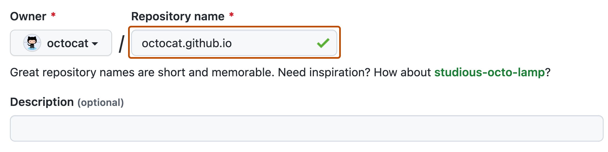

# 9. GitHub Pages

- [Statische Websites mit GitHub Pages](#)
- [Jekyll-Themes verwenden](#)
- [Benutzerdefinierte Domains einrichten](#)
- [Projektdokumentation mit Pages](#)
- [SEO für GitHub Pages](#)

## Einführung in GitHub Pages


### Video-Tutorial: GitHub Pages
[Einführung GitHub Pages | GitHub Tutorial Deutsch](https://www.youtube.com/watch?v=TvJXACCwkC8)
[Kostenloser Blog mit GitHub Pages | GitHub Tutorial Deutsch](https://www.youtube.com/watch?v=1w-kAGBxMpc)

GitHub Pages ist ein kostenloser Dienst von GitHub, der es Ihnen ermöglicht, statische Websites direkt aus einem GitHub-Repository zu hosten. Es ist eine einfache und leistungsstarke Möglichkeit, persönliche Websites, Projekt-Dokumentationen, Blogs oder Portfolios zu erstellen und zu veröffentlichen, ohne sich um Server-Management oder Hosting-Kosten kümmern zu müssen.

### Was ist GitHub Pages?

GitHub Pages nimmt HTML-, CSS- und JavaScript-Dateien direkt aus einem Repository auf GitHub, führt sie optional durch einen Build-Prozess (z.B. mit Jekyll) und veröffentlicht sie dann unter einer öffentlichen URL. Die Hauptmerkmale von GitHub Pages sind:

- **Kostenloses Hosting**: GitHub Pages ist für öffentliche Repositories kostenlos und bietet auch großzügige kostenlose Kontingente für private Repositories.
- **Einfache Einrichtung**: Die Einrichtung einer GitHub Pages-Website ist oft nur eine Frage weniger Klicks in den Repository-Einstellungen.
- **Integration mit Git**: Da die Website direkt aus einem Git-Repository gehostet wird, profitieren Sie von allen Vorteilen der Versionskontrolle, wie Änderungsverfolgung, Branching und Zusammenarbeit.
- **Unterstützung für benutzerdefinierte Domains**: Sie können Ihre eigene Domain für Ihre GitHub Pages-Website verwenden.
- **HTTPS-Unterstützung**: GitHub Pages bietet automatisch HTTPS für alle Websites, auch für solche mit benutzerdefinierten Domains.
- **Jekyll-Integration**: GitHub Pages unterstützt Jekyll, einen beliebten Generator für statische Websites, der es ermöglicht, Websites aus Markdown-Dateien und Vorlagen zu erstellen.

### Arten von GitHub Pages-Websites



Es gibt drei Haupttypen von GitHub Pages-Websites:

1.  **Benutzer- oder Organisations-Websites**: Diese Websites sind mit einem bestimmten Benutzer- oder Organisationskonto auf GitHub verknüpft. Sie werden aus einem speziellen Repository namens `<username>.github.io` oder `<orgname>.github.io` gehostet. Jedes Konto kann nur eine solche Website haben. Die URL lautet `https://<username>.github.io` oder `https://<orgname>.github.io`.

2.  **Projekt-Websites**: Diese Websites sind mit einem bestimmten Repository verknüpft (das nicht das spezielle `<username>.github.io`-Repository ist). Sie werden normalerweise verwendet, um Dokumentation oder eine Website für ein bestimmtes Projekt zu hosten. Sie können aus dem `main`-Branch, dem `gh-pages`-Branch oder einem `/docs`-Ordner im `main`-Branch veröffentlicht werden. Die URL lautet `https://<username>.github.io/<repository-name>` oder `https://<orgname>.github.io/<repository-name>`.

3.  **Community Health Files**: Repositories für Community Health Files (wie `CODE_OF_CONDUCT.md`, `CONTRIBUTING.md`) in einer Organisation können ebenfalls über GitHub Pages gehostet werden, obwohl dies weniger häufig vorkommt.

### Anwendungsfälle für GitHub Pages

GitHub Pages eignet sich hervorragend für eine Vielzahl von Anwendungsfällen:

- **Projekt-Dokumentation**: Hosten Sie die Dokumentation für Ihre Open-Source- oder privaten Projekte.
- **Persönliche Websites und Portfolios**: Erstellen Sie eine persönliche Website, um sich selbst oder Ihre Arbeit vorzustellen.
- **Blogs**: Veröffentlichen Sie einen Blog mit Jekyll oder anderen statischen Website-Generatoren.
- **Open-Source-Projekt-Websites**: Erstellen Sie eine Landing Page für Ihr Open-Source-Projekt.
- **Event-Websites**: Hosten Sie eine einfache Website für eine Konferenz oder ein Meetup.
- **Lehrmaterialien**: Veröffentlichen Sie Kursmaterialien oder Tutorials.

Es ist wichtig zu beachten, dass GitHub Pages nur für statische Websites konzipiert ist. Es unterstützt keine serverseitige Verarbeitung wie PHP, Ruby oder Python-Skripte und bietet keinen Datenbankzugriff. Für dynamische Websites müssen Sie andere Hosting-Lösungen in Betracht ziehen.

## Erstellen einer GitHub Pages-Website

Das Erstellen einer GitHub Pages-Website ist ein unkomplizierter Prozess, der direkt über die GitHub-Weboberfläche oder durch Konfiguration in Ihrem Repository erfolgen kann.

### Eine Benutzer- oder Organisations-Website erstellen

1.  **Repository erstellen**: Erstellen Sie ein neues öffentliches Repository mit dem exakten Namen `<username>.github.io` (ersetzen Sie `<username>` durch Ihren GitHub-Benutzernamen) oder `<orgname>.github.io` (für Organisationen).
2.  **Inhaltsdateien hinzufügen**: Fügen Sie Ihre Website-Dateien (HTML, CSS, JavaScript, Bilder etc.) zum Repository hinzu. Mindestens eine `index.html`-Datei im Stammverzeichnis ist erforderlich.
3.  **Pushen Sie die Änderungen**: Committen und pushen Sie Ihre Dateien zum `main`-Branch des Repositories.
4.  **Warten Sie auf die Bereitstellung**: GitHub erkennt das spezielle Repository-Format und stellt Ihre Website automatisch bereit. Es kann einige Minuten dauern, bis die Website unter `https://<username>.github.io` verfügbar ist.

### Eine Projekt-Website erstellen

1.  **Repository erstellen oder auswählen**: Verwenden Sie ein bestehendes Repository oder erstellen Sie ein neues für Ihr Projekt.
2.  **Inhaltsdateien hinzufügen**: Fügen Sie Ihre Website-Dateien zum Repository hinzu.
3.  **Quelle konfigurieren**: Navigieren Sie zu den Repository-Einstellungen ("Settings" > "Pages").
4.  **Branch auswählen**: Wählen Sie im Abschnitt "Build and deployment" unter "Source" die Option "Deploy from a branch".
5.  **Branch und Ordner auswählen**: Wählen Sie den Branch aus, von dem Sie veröffentlichen möchten (`main` oder `gh-pages`) und den Ordner (`/` (root) oder `/docs`).
    -   **Option 1: `main`-Branch, `/` (root)-Ordner**: Veröffentlicht Dateien aus dem Stammverzeichnis des `main`-Branches.
    -   **Option 2: `main`-Branch, `/docs`-Ordner**: Veröffentlicht Dateien aus dem `/docs`-Ordner im `main`-Branch. Dies ist nützlich, um Website-Code von anderem Projektcode getrennt zu halten.
    -   **Option 3: `gh-pages`-Branch**: Veröffentlicht Dateien aus dem Stammverzeichnis eines separaten Branches namens `gh-pages`. Dies ist eine gängige Methode, um den Quellcode der Website vom Quellcode des Projekts zu trennen.
6.  **Speichern**: Klicken Sie auf "Save".
7.  **Warten Sie auf die Bereitstellung**: GitHub stellt Ihre Website bereit. Sie ist unter `https://<username>.github.io/<repository-name>` verfügbar. Der Link wird in den Pages-Einstellungen angezeigt, sobald die Bereitstellung abgeschlossen ist.

### Verwendung von GitHub Actions für die Bereitstellung

Anstatt direkt aus einem Branch zu veröffentlichen, können Sie auch GitHub Actions verwenden, um Ihre Website zu bauen und bereitzustellen. Dies bietet mehr Flexibilität, insbesondere wenn Sie einen komplexen Build-Prozess oder einen statischen Website-Generator verwenden, der nicht Jekyll ist.

1.  **Workflow erstellen**: Erstellen Sie eine Workflow-Datei im Verzeichnis `.github/workflows`, z.B. `pages.yml`.
2.  **Build-Schritte definieren**: Fügen Sie Schritte hinzu, um Ihre Website zu bauen (z.B. `npm run build`).
3.  **Bereitstellungsaktion verwenden**: Verwenden Sie die `actions/deploy-pages`-Aktion, um die gebauten Artefakte bereitzustellen.

**Beispiel-Workflow für eine Node.js-basierte Website**:
```yaml
name: Deploy GitHub Pages

on:
  push:
    branches:
      - main # Oder der Branch, der Ihre Website enthält

jobs:
  build:
    runs-on: ubuntu-latest
    steps:
      - name: Checkout
        uses: actions/checkout@v3
      - name: Setup Node.js
        uses: actions/setup-node@v3
        with:
          node-version: 16
      - name: Install dependencies
        run: npm ci
      - name: Build website
        run: npm run build # Ihr Build-Befehl
      - name: Setup Pages
        uses: actions/configure-pages@v2
      - name: Upload artifact
        uses: actions/upload-pages-artifact@v1
        with:
          path: ./dist # Der Ordner mit den gebauten Dateien

  deploy:
    needs: build
    permissions:
      pages: write
      id-token: write
    environment:
      name: github-pages
      url: ${{ steps.deployment.outputs.page_url }}
    runs-on: ubuntu-latest
    steps:
      - name: Deploy to GitHub Pages
        id: deployment
        uses: actions/deploy-pages@v1
```

4.  **Quelle konfigurieren**: Gehen Sie zu den Repository-Einstellungen ("Settings" > "Pages") und wählen Sie unter "Build and deployment" die Option "GitHub Actions".

Dieser Ansatz bietet mehr Kontrolle über den Build-Prozess und ermöglicht die Verwendung beliebiger statischer Website-Generatoren oder Build-Tools.

## Arbeiten mit Jekyll

Jekyll ist ein beliebter Generator für statische Websites, der eng in GitHub Pages integriert ist. Er ermöglicht es Ihnen, Websites aus einfachen Textdateien (wie Markdown) und Vorlagen zu erstellen.

### Jekyll-Grundlagen

Jekyll nimmt Ihre Inhaltsdateien, verarbeitet sie durch Vorlagen und Layouts und generiert eine vollständige, statische Website.

- **Markdown-Unterstützung**: Schreiben Sie Inhalte in Markdown, und Jekyll konvertiert sie in HTML.
- **Vorlagen und Layouts**: Verwenden Sie die Liquid-Templating-Sprache, um wiederverwendbare Layouts und Vorlagen zu erstellen.
- **Daten-Dateien**: Speichern Sie strukturierte Daten in YAML-, JSON- oder CSV-Dateien und greifen Sie darauf in Ihren Vorlagen zu.
- **Plugins**: Erweitern Sie die Funktionalität von Jekyll mit Plugins (obwohl GitHub Pages nur eine begrenzte Anzahl von Plugins unterstützt).

### Jekyll mit GitHub Pages verwenden

GitHub Pages hat eine integrierte Unterstützung für Jekyll. Wenn Sie Jekyll verwenden möchten:

1.  **Strukturieren Sie Ihr Repository**: Organisieren Sie Ihre Dateien gemäß der Jekyll-Verzeichnisstruktur (z.B. `_layouts`, `_includes`, `_posts`, `assets`).
2.  **Konfigurationsdatei**: Fügen Sie eine `_config.yml`-Datei hinzu, um Jekyll-Einstellungen zu konfigurieren.
3.  **Quelle auswählen**: Wählen Sie in den Pages-Einstellungen den Branch aus, der Ihren Jekyll-Quellcode enthält (normalerweise `main`).
4.  **Build-Prozess**: GitHub Pages erkennt automatisch, dass es sich um ein Jekyll-Projekt handelt, und führt den `jekyll build`-Prozess aus, bevor die Website veröffentlicht wird.

### Jekyll-Themes

GitHub Pages unterstützt die Verwendung von Jekyll-Themes, um das Erscheinungsbild Ihrer Website schnell anzupassen.

1.  **Theme auswählen**: Wählen Sie ein unterstütztes Theme (siehe [GitHub Pages-Dokumentation](https://pages.github.com/themes/)) oder verwenden Sie ein benutzerdefiniertes Theme.
2.  **Theme in `_config.yml` festlegen**:
    ```yaml
    theme: jekyll-theme-minimal
    ```
3.  **Theme-Gem hinzufügen**: Fügen Sie das Theme-Gem zu Ihrer `Gemfile` hinzu (wenn Sie lokal entwickeln).

GitHub Pages kümmert sich um die Installation und Anwendung des Themes während des Build-Prozesses.

### Lokale Jekyll-Entwicklung

Es wird dringend empfohlen, Jekyll lokal zu installieren, um Ihre Website vor dem Pushen zu testen:

1.  **Ruby und Bundler installieren**: Folgen Sie den Anweisungen auf der Jekyll-Website.
2.  **Gemfile erstellen**: Erstellen Sie eine `Gemfile`-Datei in Ihrem Repository-Stammverzeichnis:
    ```ruby
    source "https://rubygems.org"
    gem "github-pages", group: :jekyll_plugins
    ```
3.  **Abhängigkeiten installieren**: Führen Sie `bundle install` aus.
4.  **Lokalen Server starten**: Führen Sie `bundle exec jekyll serve` aus.
5.  **Website anzeigen**: Öffnen Sie `http://localhost:4000` in Ihrem Browser.

Dies stellt sicher, dass Ihre Website lokal genauso aussieht und funktioniert wie auf GitHub Pages.

## Benutzerdefinierte Domains

Standardmäßig werden GitHub Pages-Websites unter einer `github.io`-Subdomain gehostet. Sie können jedoch auch eine benutzerdefinierte Domain (z.B. `www.example.com`) für Ihre Website konfigurieren.

### Konfigurieren einer benutzerdefinierten Domain

1.  **Domain erwerben**: Kaufen Sie eine Domain bei einem Domain-Registrar (z.B. GoDaddy, Namecheap, Google Domains).
2.  **DNS-Einträge konfigurieren**: Konfigurieren Sie die DNS-Einträge Ihrer Domain so, dass sie auf die GitHub Pages-Server verweisen.
    -   **Für Apex-Domains (z.B. `example.com`)**: Erstellen Sie `A`-Einträge, die auf die IP-Adressen von GitHub Pages zeigen (die aktuellen IPs finden Sie in der GitHub-Dokumentation).
    -   **Für Subdomains (z.B. `www.example.com` oder `blog.example.com`)**: Erstellen Sie einen `CNAME`-Eintrag, der auf `<username>.github.io` verweist.
3.  **Benutzerdefinierte Domain in GitHub hinzufügen**: Navigieren Sie zu den Repository-Einstellungen ("Settings" > "Pages"). Geben Sie im Abschnitt "Custom domain" Ihre benutzerdefinierte Domain ein und klicken Sie auf "Save".
4.  **CNAME-Datei (optional, aber empfohlen)**: GitHub erstellt möglicherweise automatisch eine `CNAME`-Datei im Stammverzeichnis Ihres Veröffentlichungs-Branches. Diese Datei enthält nur Ihre benutzerdefinierte Domain. Es ist gut, diese Datei im Repository zu behalten.
5.  **Warten Sie auf DNS-Propagation**: Es kann einige Zeit dauern (bis zu 24 Stunden), bis die DNS-Änderungen weltweit wirksam werden.
6.  **HTTPS erzwingen (optional, aber empfohlen)**: Sobald die DNS-Konfiguration überprüft wurde, können Sie die Option "Enforce HTTPS" aktivieren, um sicherzustellen, dass Ihre Website immer über eine sichere Verbindung bereitgestellt wird.

### Apex-Domains vs. Subdomains

-   **Apex-Domain**: Die Root-Domain (z.B. `example.com`). Erfordert `A`-Einträge.
-   **Subdomain**: Ein Präfix vor der Apex-Domain (z.B. `www.example.com`, `blog.example.com`). Erfordert einen `CNAME`-Eintrag. Die Verwendung einer `www`-Subdomain wird oft empfohlen, da `CNAME`-Einträge flexibler sind als `A`-Einträge.

### Fehlerbehebung bei benutzerdefinierten Domains

-   **DNS-Überprüfung**: Verwenden Sie Tools wie `dig` oder Online-DNS-Checker, um zu überprüfen, ob Ihre DNS-Einträge korrekt konfiguriert sind und auf die richtigen GitHub-Server verweisen.
-   **CNAME-Datei**: Stellen Sie sicher, dass die `CNAME`-Datei (falls vorhanden) nur Ihre benutzerdefinierte Domain enthält und keine zusätzlichen Zeichen oder Leerzeilen.
-   **HTTPS-Status**: Überprüfen Sie den HTTPS-Status in den Pages-Einstellungen. Es kann einige Zeit dauern, bis das SSL/TLS-Zertifikat bereitgestellt wird.
-   **GitHub-Statusseite**: Überprüfen Sie die [GitHub-Statusseite](https://www.githubstatus.com/), um sicherzustellen, dass es keine bekannten Probleme mit GitHub Pages gibt.

## Fortgeschrittene Funktionen und Best Practices

Neben den Grundlagen bietet GitHub Pages weitere Funktionen und es gibt bewährte Methoden, um Ihre Website zu optimieren.

### Umgebungsvariablen

Wenn Sie GitHub Actions für die Bereitstellung verwenden, können Sie Umgebungsvariablen nutzen, um Konfigurationswerte während des Build-Prozesses zu übergeben. Secrets sollten für sensible Daten verwendet werden.

### Weiterleitungen

GitHub Pages unterstützt keine serverseitigen Weiterleitungen (wie `.htaccess`). Sie können jedoch clientseitige Weiterleitungen implementieren:

-   **HTML-Meta-Refresh**: Fügen Sie `<meta http-equiv="refresh" content="0; url=https://new-url.com/">` in den `<head>` Ihrer alten Seite ein.
-   **JavaScript-Weiterleitung**: Verwenden Sie `window.location.replace("https://new-url.com/");`.
-   **Jekyll-Redirect-From Plugin**: Wenn Sie Jekyll verwenden, kann das `jekyll-redirect-from`-Plugin (von GitHub Pages unterstützt) Weiterleitungen einfacher verwalten.

### Fehlerseiten (404)

Sie können eine benutzerdefinierte 404-Fehlerseite erstellen, indem Sie eine `404.html`-Datei im Stammverzeichnis Ihres Veröffentlichungs-Branches hinzufügen. GitHub Pages zeigt diese Seite automatisch an, wenn ein Besucher auf eine nicht existierende URL zugreift.

### Optimierung für Suchmaschinen (SEO)

-   **Sinnvolle Titel und Beschreibungen**: Verwenden Sie aussagekräftige `<title>`-Tags und Meta-Beschreibungen für jede Seite.
-   **Sitemap**: Erstellen Sie eine `sitemap.xml`-Datei, um Suchmaschinen beim Crawlen Ihrer Website zu helfen. Jekyll kann dies automatisch generieren.
-   **Robots.txt**: Erstellen Sie eine `robots.txt`-Datei, um das Verhalten von Suchmaschinen-Crawlern zu steuern.
-   **Benutzerdefinierte Domain**: Eine benutzerdefinierte Domain kann professioneller wirken und das Branding verbessern.
-   **HTTPS**: Stellen Sie sicher, dass HTTPS erzwungen wird, da dies ein Ranking-Faktor ist.
-   **Mobile Freundlichkeit**: Gestalten Sie Ihre Website responsiv, damit sie auf allen Geräten gut aussieht.

### Sicherheit

-   **HTTPS erzwingen**: Aktivieren Sie immer "Enforce HTTPS".
-   **Keine sensiblen Daten**: Speichern Sie niemals sensible Daten direkt im Repository Ihrer GitHub Pages-Website, da es öffentlich zugänglich ist.
-   **Abhängigkeiten aktuell halten**: Wenn Sie einen statischen Website-Generator verwenden, halten Sie dessen Abhängigkeiten auf dem neuesten Stand, um Sicherheitslücken zu vermeiden.
-   **Cross-Site Scripting (XSS)**: Seien Sie vorsichtig bei der Einbindung von Inhalten Dritter oder benutzergenerierten Inhalten, um XSS-Angriffe zu verhindern.

### Leistungsoptimierung

-   **Bilder optimieren**: Komprimieren Sie Bilder und verwenden Sie geeignete Formate (wie WebP).
-   **CSS und JavaScript minimieren**: Reduzieren Sie die Dateigröße von CSS- und JavaScript-Dateien.
-   **Caching nutzen**: Konfigurieren Sie Browser-Caching über HTTP-Header (obwohl dies bei GitHub Pages begrenzt ist).
-   **Content Delivery Network (CDN)**: Obwohl GitHub Pages bereits ein CDN verwendet, können Sie für zusätzliche Leistung und Kontrolle einen externen CDN-Dienst wie Cloudflare vor Ihre Website schalten.

### Einschränkungen von GitHub Pages

Es ist wichtig, die Einschränkungen von GitHub Pages zu kennen:

-   **Nur statische Inhalte**: Keine serverseitige Verarbeitung oder Datenbanken.
-   **Nutzungsbeschränkungen**: Es gibt Limits für die Größe des Repositorys (1 GB empfohlen), Bandbreite (100 GB/Monat) und Builds (10 Builds/Stunde).
-   **Keine kommerzielle Nutzung (mit Einschränkungen)**: GitHub Pages ist nicht für den Betrieb von Online-Geschäften oder kommerziellen Transaktions-Websites gedacht. Die genauen Bedingungen finden Sie in den GitHub Pages-Nutzungsbedingungen.
-   **Build-Zeiten**: Jekyll-Builds können bei sehr großen Websites langsam werden.

## Fazit

GitHub Pages ist ein äußerst nützlicher und vielseitiger Dienst für das Hosting statischer Websites. Egal, ob Sie eine einfache persönliche Seite, eine Projekt-Dokumentation oder einen Blog erstellen möchten, GitHub Pages bietet eine kostenlose, einfache und gut integrierte Lösung.

Durch die Kombination mit Git, GitHub Actions und optional Jekyll können Sie robuste Workflows für die Erstellung, Verwaltung und Bereitstellung Ihrer Websites einrichten. Mit der Unterstützung für benutzerdefinierte Domains und HTTPS können Sie professionelle und sichure Websites direkt aus Ihren GitHub-Repositories hosten.

Obwohl es Einschränkungen gibt (insbesondere die Beschränkung auf statische Inhalte), ist GitHub Pages für eine Vielzahl von Anwendungsfällen eine ausgezeichnete Wahl und ein wertvolles Werkzeug im Ökosystem von GitHub.
