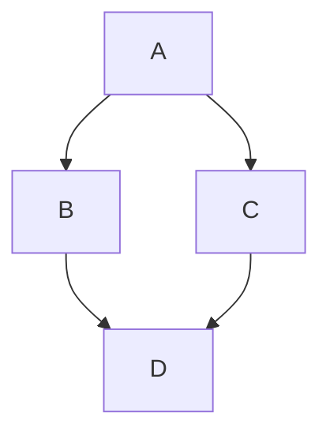

# 10. GitHub für Entwickler

## Entwicklungsumgebungen und GitHub

Die Integration von GitHub in Ihre Entwicklungsumgebung kann Ihren Workflow erheblich verbessern und effizienter gestalten. Moderne Entwicklungsumgebungen bieten verschiedene Möglichkeiten, nahtlos mit GitHub zu interagieren, ohne die IDE verlassen zu müssen.

### Integration in Code-Editoren und IDEs

Die meisten modernen Code-Editoren und integrierten Entwicklungsumgebungen (IDEs) bieten native Unterstützung oder Erweiterungen für die Integration mit GitHub. Hier sind einige der beliebtesten Optionen:

**Visual Studio Code (VS Code)**:
VS Code bietet eine hervorragende GitHub-Integration durch mehrere Funktionen und Erweiterungen:

- **Integrierte Quellcodeverwaltung**: VS Code hat eine eingebaute Git-Unterstützung, mit der Sie Änderungen committen, pushen und pullen können.
- **GitHub Pull Requests and Issues Extension**: Diese offizielle Erweiterung ermöglicht es Ihnen, Pull Requests und Issues direkt in VS Code zu erstellen, zu überprüfen und zu verwalten.
- **GitHub Copilot**: Eine KI-gestützte Erweiterung, die Codevorschläge basierend auf dem Kontext Ihres Projekts und öffentlichen GitHub-Repositories anbietet.
- **GitLens**: Eine leistungsstarke Erweiterung, die Git-Funktionen in VS Code erweitert, einschließlich Blame-Informationen, Verlaufsansicht und mehr.

**JetBrains IDEs (IntelliJ IDEA, PyCharm, WebStorm, etc.)**:
Die JetBrains-Suite von IDEs bietet umfassende GitHub-Integration:

- **Integrierte Git-Unterstützung**: Alle JetBrains-IDEs haben robuste Git-Funktionen eingebaut.
- **GitHub-Integration**: Direkte Unterstützung für GitHub-spezifische Funktionen wie Pull Requests, Issues und Code-Reviews.
- **Space-Integration**: Integration mit JetBrains Space, das mit GitHub zusammenarbeiten kann.

**Atom**:
Obwohl die aktive Entwicklung von Atom eingestellt wurde, ist es immer noch ein beliebter Editor mit guter GitHub-Integration (da es ursprünglich von GitHub entwickelt wurde):

- **GitHub-Paket**: Bietet Funktionen wie Blame, Verlauf und Pull Requests direkt im Editor.
- **Git-Integration**: Integrierte Git-Funktionen für grundlegende Versionskontrolle.

**Sublime Text**:
Sublime Text kann mit GitHub über verschiedene Pakete integriert werden:

- **GitSavvy**: Ein umfassendes Git- und GitHub-Paket für Sublime Text.
- **Sublime Merge**: Ein separater Git-Client von den Machern von Sublime Text, der gut mit dem Editor zusammenarbeitet.

**Eclipse**:
Eclipse bietet GitHub-Integration durch Plugins:

- **EGit**: Das offizielle Git-Plugin für Eclipse.
- **GitHub Mylyn Connector**: Ermöglicht die Integration mit GitHub Issues.

### GitHub CLI

Die GitHub Command Line Interface (CLI) ist ein leistungsstarkes Werkzeug, das es Ihnen ermöglicht, GitHub direkt von Ihrer Kommandozeile aus zu verwenden. Es bietet Zugriff auf fast alle GitHub-Funktionen, ohne dass Sie einen Browser öffnen müssen.

**Installation**:
Die GitHub CLI ist für Windows, macOS und Linux verfügbar. Sie können sie über Paketmanager wie Homebrew (macOS), Scoop oder Chocolatey (Windows) oder direkt von der [GitHub CLI-Website](https://cli.github.com/) installieren.

**Authentifizierung**:
Nach der Installation müssen Sie sich bei Ihrem GitHub-Konto authentifizieren:
```bash
gh auth login
```
Sie können sich über HTTPS oder SSH authentifizieren und werden durch den Prozess geführt.

**Häufige Befehle**:

- **Repositories**:
  ```bash
  gh repo create       # Repository erstellen
  gh repo clone        # Repository klonen
  gh repo view         # Repository-Details anzeigen
  gh repo fork         # Repository forken
  ```

- **Pull Requests**:
  ```bash
  gh pr create         # Pull Request erstellen
  gh pr checkout       # Pull Request auschecken
  gh pr list           # Pull Requests auflisten
  gh pr view           # Pull Request-Details anzeigen
  gh pr merge          # Pull Request zusammenführen
  ```

- **Issues**:
  ```bash
  gh issue create      # Issue erstellen
  gh issue list        # Issues auflisten
  gh issue view        # Issue-Details anzeigen
  gh issue close       # Issue schließen
  ```

- **Workflows**:
  ```bash
  gh workflow list     # GitHub Actions-Workflows auflisten
  gh workflow run      # Workflow manuell ausführen
  gh workflow view     # Workflow-Details anzeigen
  ```

- **Releases**:
  ```bash
  gh release create    # Release erstellen
  gh release list      # Releases auflisten
  gh release view      # Release-Details anzeigen
  ```

Die GitHub CLI ist besonders nützlich für die Automatisierung von Aufgaben und die Integration in Skripte und CI/CD-Pipelines.

### GitHub Desktop

GitHub Desktop ist eine benutzerfreundliche grafische Benutzeroberfläche für Git und GitHub, die für Entwickler entwickelt wurde, die eine visuelle Alternative zur Kommandozeile bevorzugen.

**Hauptfunktionen**:

- **Einfache Repository-Verwaltung**: Klonen, Erstellen und Verwalten von Repositories mit wenigen Klicks.
- **Visualisierung von Änderungen**: Übersichtliche Darstellung von Dateiänderungen und Unterschieden.
- **Vereinfachter Workflow**: Einfaches Committen, Pushen, Pullen und Branchen ohne Kommandozeilenbefehle.
- **Pull Request-Integration**: Erstellen und Überprüfen von Pull Requests direkt aus der Anwendung.
- **Konfliktlösung**: Visuelle Werkzeuge zur Lösung von Merge-Konflikten.

GitHub Desktop ist besonders nützlich für:
- Entwickler, die neu in Git und GitHub sind
- Visuelle Lerner, die Änderungen lieber grafisch sehen
- Schnelle Aufgaben, bei denen die Kommandozeile umständlich sein könnte
- Teams mit gemischten Git-Erfahrungsstufen

### GitHub Codespaces

GitHub Codespaces ist eine cloudbasierte Entwicklungsumgebung, die direkt in GitHub integriert ist. Es ermöglicht Ihnen, Code in einem vollständig konfigurierten Entwicklungscontainer zu schreiben, zu bearbeiten, zu testen und zu debuggen, ohne lokale Einrichtung.

**Hauptfunktionen**:

- **Browserbasierte Entwicklung**: Vollständige VS Code-Erfahrung im Browser.
- **Benutzerdefinierte Entwicklungscontainer**: Definieren Sie Ihre Entwicklungsumgebung als Code mit devcontainer.json.
- **Vorinstallierte Abhängigkeiten**: Starten Sie schnell mit vorinstallierten Sprachen, Tools und Abhängigkeiten.
- **Nahtlose GitHub-Integration**: Direkte Integration mit GitHub-Repositories, Pull Requests und Issues.
- **Leistungsstarke Rechenressourcen**: Zugriff auf leistungsstarke Cloud-Computer für ressourcenintensive Aufgaben.
- **Portabilität**: Arbeiten Sie von jedem Gerät mit Internetverbindung aus.

**Einrichtung eines Codespace**:

1. Navigieren Sie zu einem Repository auf GitHub.
2. Klicken Sie auf die Schaltfläche "Code" und wählen Sie die Registerkarte "Codespaces".
3. Klicken Sie auf "New codespace".
4. Wählen Sie einen Branch, eine Region und eine Maschinengröße (falls verfügbar).
5. Warten Sie, bis der Codespace erstellt und gestartet ist.

**Anpassung mit devcontainer.json**:

Sie können Ihren Codespace mit einer `devcontainer.json`-Datei im Verzeichnis `.devcontainer` Ihres Repositories anpassen:

```json
{
  "name": "My Project",
  "image": "mcr.microsoft.com/devcontainers/javascript-node:0-16",
  "extensions": [
    "dbaeumer.vscode-eslint",
    "esbenp.prettier-vscode"
  ],
  "postCreateCommand": "npm install",
  "settings": {
    "editor.formatOnSave": true
  }
}
```

Diese Datei definiert:
- Das Basis-Image für den Container
- VS Code-Erweiterungen, die automatisch installiert werden sollen
- Befehle, die nach der Erstellung des Containers ausgeführt werden sollen
- VS Code-Einstellungen für den Codespace

GitHub Codespaces ist besonders nützlich für:
- Open-Source-Beiträge
- Schulungen und Workshops
- Konsistente Entwicklungsumgebungen in Teams
- Entwicklung auf ressourcenbeschränkten Geräten
- Schnelles Prototyping und Codeüberprüfung

## Fortgeschrittene Git-Techniken für GitHub

Während grundlegende Git-Befehle für die tägliche Arbeit ausreichen, können fortgeschrittene Git-Techniken Ihren Workflow erheblich verbessern und Ihnen helfen, komplexe Situationen zu bewältigen.

### Effektive Branching-Strategien

Eine gut durchdachte Branching-Strategie ist entscheidend für erfolgreiche Zusammenarbeit und Codequalität. Hier sind einige bewährte Strategien:

**GitHub Flow**:
Eine einfache, branchbasierte Workflow-Strategie:

1. Erstellen Sie einen Branch von `main` für jede neue Funktion oder Fehlerbehebung.
2. Nehmen Sie Änderungen vor und committen Sie regelmäßig.
3. Öffnen Sie einen Pull Request, wenn Sie bereit sind.
4. Diskutieren und überprüfen Sie den Code.
5. Führen Sie den Branch in `main` zusammen, wenn alles in Ordnung ist.
6. Stellen Sie den Code bereit.

Diese Strategie ist ideal für kontinuierliche Bereitstellung und kleinere Teams.

**Git Flow**:
Eine robustere Strategie mit mehreren Branch-Typen:

- `main`: Produktionscode
- `develop`: Entwicklungscode
- Feature-Branches: Zweige von `develop` für neue Funktionen
- Release-Branches: Zweige von `develop` zur Vorbereitung eines Releases
- Hotfix-Branches: Zweige von `main` für dringende Fehlerbehebungen

Git Flow eignet sich gut für Projekte mit geplanten Releases und größeren Teams.

**Trunk-Based Development**:
Eine Strategie, die sich auf häufige Integration in einen Hauptbranch konzentriert:

1. Entwickler arbeiten in kurzlebigen Feature-Branches (1-2 Tage).
2. Code wird mehrmals täglich in den Hauptbranch integriert.
3. Feature Flags werden verwendet, um unvollständige Funktionen zu verbergen.
4. Umfangreiche automatisierte Tests stellen die Stabilität sicher.

Diese Strategie fördert kontinuierliche Integration und reduziert Merge-Konflikte.

### Rebasing vs. Merging

Rebasing und Merging sind zwei verschiedene Methoden, um Änderungen aus einem Branch in einen anderen zu integrieren. Jede hat ihre Vor- und Nachteile.

**Merging**:
```bash
git checkout main
git merge feature-branch
```

Vorteile:
- Nicht-destruktiv: Ändert die bestehende Commit-Historie nicht
- Einfach zu verstehen und zu verwenden
- Zeigt klar, wo ein Feature-Branch integriert wurde

Nachteile:
- Erzeugt einen zusätzlichen Merge-Commit
- Kann zu einer unübersichtlichen Commit-Historie führen
- Kann die Nachverfolgung von Änderungen erschweren

**Rebasing**:
```bash
git checkout feature-branch
git rebase main
```

Vorteile:
- Erzeugt eine lineare, saubere Commit-Historie
- Vermeidet unnötige Merge-Commits
- Erleichtert das Verständnis der Projektentwicklung

Nachteile:
- Ändert die Commit-Historie (neue Commit-Hashes)
- Kann problematisch sein, wenn der Branch bereits gepusht wurde
- Komplexer bei Konflikten

**Wann was verwenden**:

- Verwenden Sie **Merging** für:
  - Zusammenführen von Feature-Branches in den Hauptbranch
  - Öffentliche/gemeinsam genutzte Branches
  - Wenn die Nachverfolgung des genauen Merge-Punkts wichtig ist

- Verwenden Sie **Rebasing** für:
  - Aktualisieren von Feature-Branches mit Änderungen aus dem Hauptbranch
  - Private/persönliche Branches, die noch nicht gepusht wurden
  - Wenn eine saubere, lineare Historie bevorzugt wird

**GitHub Pull Request-Optionen**:
GitHub bietet verschiedene Merge-Optionen für Pull Requests:

1. **Create a merge commit**: Erstellt einen Standard-Merge-Commit.
2. **Squash and merge**: Fasst alle Commits des Feature-Branches in einen einzigen Commit zusammen.
3. **Rebase and merge**: Führt ein Rebase der Commits auf den Basis-Branch durch und führt sie dann zusammen.

Repository-Administratoren können festlegen, welche dieser Optionen verfügbar sind.

### Interaktives Rebasing

Interaktives Rebasing ist ein leistungsstarkes Werkzeug zur Bereinigung der Commit-Historie, bevor Sie Ihren Code teilen.

```bash
git rebase -i HEAD~5  # Interaktives Rebase der letzten 5 Commits
```

Dies öffnet einen Editor mit einer Liste von Commits und Befehlen:

```
pick f7f3f6d Commit-Nachricht 1
pick 310154e Commit-Nachricht 2
pick a5f4a0d Commit-Nachricht 3
pick 07c5abd Commit-Nachricht 4
pick 3de5e5e Commit-Nachricht 5
```

Sie können diese Befehle ändern, um verschiedene Aktionen auszuführen:

- `pick`: Commit unverändert verwenden
- `reword`: Commit verwenden, aber Commit-Nachricht ändern
- `edit`: Commit verwenden, aber anhalten, um Änderungen vorzunehmen
- `squash`: Commit mit dem vorherigen Commit zusammenfassen
- `fixup`: Wie squash, aber Commit-Nachricht verwerfen
- `drop`: Commit entfernen

Interaktives Rebasing ist nützlich für:
- Zusammenfassen mehrerer kleiner Commits zu logischen Einheiten
- Entfernen von temporären oder fehlerhaften Commits
- Umordnen von Commits für eine logischere Abfolge
- Verbessern von Commit-Nachrichten

### Cherry-Picking

Cherry-Picking ermöglicht es Ihnen, bestimmte Commits aus einem Branch in einen anderen zu übernehmen, ohne den gesamten Branch zusammenzuführen.

```bash
git cherry-pick <commit-hash>
```

Dies ist nützlich für:
- Übertragen spezifischer Fehlerbehebungen in Release-Branches
- Selektives Übernehmen von Funktionen
- Wiederherstellung bestimmter Änderungen, die versehentlich rückgängig gemacht wurden

**Beispiel-Workflow**:
1. Identifizieren Sie den Commit-Hash mit `git log`.
2. Wechseln Sie zum Zielbranch: `git checkout target-branch`.
3. Cherry-picken Sie den Commit: `git cherry-pick abc1234`.
4. Lösen Sie Konflikte, falls vorhanden.
5. Führen Sie den Cherry-Pick fort: `git cherry-pick --continue`.

### Reflog und Wiederherstellung

Git hält ein Reflog (Referenzprotokoll) bei, das alle Änderungen an Branches und Referenzen in Ihrem lokalen Repository aufzeichnet. Dies ist ein Sicherheitsnetz, das Ihnen helfen kann, verlorene Commits wiederherzustellen.

**Reflog anzeigen**:
```bash
git reflog
```

Dies zeigt eine Liste von Aktionen mit Commit-Hashes:
```
a1b2c3d HEAD@{0}: commit: Add new feature
e4f5g6h HEAD@{1}: checkout: moving from main to feature-branch
i7j8k9l HEAD@{2}: commit: Fix bug in login form
```

**Wiederherstellung von verlorenen Commits**:
Wenn Sie versehentlich einen Branch zurückgesetzt oder gelöscht haben, können Sie ihn mit dem Reflog wiederherstellen:

```bash
git checkout -b recovered-branch HEAD@{2}  # Erstellt einen neuen Branch vom Zustand vor 2 Aktionen
```

Oder Sie können zu einem bestimmten Commit zurückkehren:
```bash
git reset --hard a1b2c3d  # Zurücksetzen auf den Commit mit Hash a1b2c3d
```

Das Reflog ist besonders nützlich für:
- Wiederherstellung nach einem fehlgeschlagenen Rebase oder Merge
- Wiederfinden von Commits nach einem versehentlichen Reset
- Rettung von Arbeit, die nicht committet wurde (mit `git fsck --lost-found`)

### Submodule und Subtrees

Für Projekte, die externe Repositories einbinden müssen, bietet Git zwei Hauptansätze: Submodule und Subtrees.

**Submodule**:
Submodule sind Referenzen auf spezifische Commits in externen Repositories.

```bash
# Hinzufügen eines Submoduls
git submodule add https://github.com/username/repo.git path/to/submodule

# Initialisieren und Aktualisieren von Submodulen nach dem Klonen
git submodule update --init --recursive

# Aktualisieren aller Submodule auf die neuesten Commits
git submodule update --remote
```

Vorteile:
- Klare Trennung zwischen Haupt- und Subprojekten
- Präzise Kontrolle über die verwendeten Versionen
- Geringere Repository-Größe

Nachteile:
- Komplexere Workflows für Teammitglieder
- Zusätzliche Befehle erforderlich
- Kann zu Verwirrung führen, wenn nicht richtig verwaltet

**Subtrees**:
Subtrees integrieren den Code eines externen Repositories direkt in Ihr Hauptrepository.

```bash
# Hinzufügen eines Subtrees
git subtree add --prefix=path/to/subtree https://github.com/username/repo.git main --squash

# Aktualisieren eines Subtrees
git subtree pull --prefix=path/to/subtree https://github.com/username/repo.git main --squash

# Änderungen zurück zum Upstream-Repository pushen
git subtree push --prefix=path/to/subtree https://github.com/username/repo.git main
```

Vorteile:
- Einfacherer Workflow für Teammitglieder (keine speziellen Befehle erforderlich)
- Historische Daten sind im Hauptrepository enthalten
- Funktioniert mit älteren Git-Versionen

Nachteile:
- Kann die Repository-Größe erhöhen
- Weniger klare Trennung zwischen Projekten
- Komplexere Merge-Konflikte möglich

Die Wahl zwischen Submodulen und Subtrees hängt von Ihren spezifischen Anforderungen ab:
- Verwenden Sie **Submodule**, wenn Sie eine strikte Versionskontrolle und klare Trennung benötigen.
- Verwenden Sie **Subtrees**, wenn Sie eine einfachere Benutzererfahrung und bessere Integration bevorzugen.

## GitHub API und Automatisierung

Die GitHub API ermöglicht es Entwicklern, programmatisch mit GitHub zu interagieren und Workflows zu automatisieren. Sie bietet Zugriff auf fast alle Funktionen, die über die Weboberfläche verfügbar sind.

### Grundlagen der GitHub API

Die GitHub API ist eine RESTful API, die JSON-Antworten zurückgibt. Es gibt mehrere Versionen, wobei die aktuelle Version die GitHub REST API v3 ist. Daneben gibt es auch die GitHub GraphQL API v4, die komplexere Abfragen ermöglicht.

**Authentifizierung**:
Um die GitHub API zu nutzen, benötigen Sie ein Authentifizierungstoken:

1. Navigieren Sie zu Ihren GitHub-Einstellungen > "Developer settings" > "Personal access tokens".
2. Klicken Sie auf "Generate new token".
3. Wählen Sie die erforderlichen Berechtigungen (Scopes) aus.
4. Kopieren und speichern Sie das generierte Token sicher.

**Beispiel für eine einfache API-Anfrage mit curl**:
```bash
curl -H "Authorization: token YOUR_TOKEN" https://api.github.com/user
```

**Beispiel mit Python und der Requests-Bibliothek**:
```python
import requests

headers = {
    'Authorization': 'token YOUR_TOKEN',
    'Accept': 'application/vnd.github.v3+json'
}

response = requests.get('https://api.github.com/user', headers=headers)
user_data = response.json()
print(f"Hallo, {user_data['login']}!")
```

**Rate Limits**:
Die GitHub API hat Rate Limits, um Missbrauch zu verhindern:
- Für authentifizierte Anfragen: 5.000 Anfragen pro Stunde
- Für nicht authentifizierte Anfragen: 60 Anfragen pro Stunde

Sie können Ihr aktuelles Rate Limit überprüfen:
```bash
curl -H "Authorization: token YOUR_TOKEN" https://api.github.com/rate_limit
```

### Häufige API-Anwendungsfälle

Die GitHub API kann für verschiedene Aufgaben verwendet werden:

**Repository-Verwaltung**:
```python
# Repository erstellen
response = requests.post(
    'https://api.github.com/user/repos',
    headers=headers,
    json={
        'name': 'neues-repo',
        'description': 'Ein neues Repository',
        'private': False
    }
)

# Repository-Details abrufen
response = requests.get(
    'https://api.github.com/repos/username/repo-name',
    headers=headers
)

# Repository löschen
response = requests.delete(
    'https://api.github.com/repos/username/repo-name',
    headers=headers
)
```

**Issues und Pull Requests**:
```python
# Issue erstellen
response = requests.post(
    'https://api.github.com/repos/username/repo-name/issues',
    headers=headers,
    json={
        'title': 'Neues Feature benötigt',
        'body': 'Bitte implementieren Sie dieses Feature...',
        'labels': ['enhancement']
    }
)

# Pull Requests auflisten
response = requests.get(
    'https://api.github.com/repos/username/repo-name/pulls',
    headers=headers
)

# Pull Request kommentieren
response = requests.post(
    'https://api.github.com/repos/username/repo-name/issues/123/comments',
    headers=headers,
    json={
        'body': 'Großartige Arbeit! Ich habe ein paar Vorschläge...'
    }
)
```

**Workflow-Automatisierung**:
```python
# Workflow-Lauf auslösen
response = requests.post(
    'https://api.github.com/repos/username/repo-name/actions/workflows/workflow-file.yml/dispatches',
    headers=headers,
    json={
        'ref': 'main',
        'inputs': {
            'parameter1': 'value1',
            'parameter2': 'value2'
        }
    }
)

# Workflow-Läufe auflisten
response = requests.get(
    'https://api.github.com/repos/username/repo-name/actions/runs',
    headers=headers
)
```

### GitHub Apps vs. OAuth Apps

GitHub bietet zwei Haupttypen von Integrationen: GitHub Apps und OAuth Apps.

**GitHub Apps**:
GitHub Apps sind die empfohlene Methode für Integrationen. Sie bieten:

- Feinkörnige Berechtigungen
- Repository-spezifische Installation
- Höhere Rate Limits
- Webhook-Ereignisse
- Möglichkeit, als App oder im Namen von Benutzern zu handeln

**Erstellen einer GitHub App**:
1. Navigieren Sie zu Ihren GitHub-Einstellungen > "Developer settings" > "GitHub Apps".
2. Klicken Sie auf "New GitHub App".
3. Geben Sie die erforderlichen Informationen ein und konfigurieren Sie Berechtigungen und Webhook-Ereignisse.
4. Nach der Erstellung generieren Sie einen privaten Schlüssel für die Authentifizierung.

**OAuth Apps**:
OAuth Apps sind traditionelle OAuth2-Anwendungen, die im Namen von Benutzern handeln. Sie bieten:

- Einfachere Einrichtung
- Zugriff auf alle Repositories eines Benutzers (mit entsprechenden Berechtigungen)
- Vertraute OAuth2-Flows

**Erstellen einer OAuth App**:
1. Navigieren Sie zu Ihren GitHub-Einstellungen > "Developer settings" > "OAuth Apps".
2. Klicken Sie auf "New OAuth App".
3. Geben Sie die erforderlichen Informationen ein, einschließlich der Callback-URL.
4. Nach der Erstellung erhalten Sie eine Client-ID und ein Client-Secret.

**Wann was verwenden**:
- Verwenden Sie **GitHub Apps** für:
  - Integrationen, die auf bestimmte Repositories beschränkt sein sollen
  - Anwendungen, die minimale Berechtigungen benötigen
  - Dienste, die sowohl als App als auch im Namen von Benutzern handeln müssen

- Verwenden Sie **OAuth Apps** für:
  - Einfache Integrationen, die im Namen von Benutzern handeln
  - Anwendungen, die Zugriff auf alle Repositories eines Benutzers benötigen
  - Fälle, in denen der traditionelle OAuth2-Flow bevorzugt wird

### Webhooks

Webhooks ermöglichen es GitHub, Ereignisse an externe Dienste zu senden, wenn bestimmte Aktionen in einem Repository auftreten. Dies ist nützlich für die Automatisierung von Workflows und die Integration mit anderen Systemen.

**Einrichten eines Webhooks**:
1. Navigieren Sie zu den Repository-Einstellungen > "Webhooks".
2. Klicken Sie auf "Add webhook".
3. Geben Sie die Payload-URL ein (die URL, an die GitHub Ereignisse senden soll).
4. Wählen Sie den Content-Typ (application/json oder application/x-www-form-urlencoded).
5. Konfigurieren Sie ein Secret für die Sicherheit.
6. Wählen Sie die Ereignisse aus, die den Webhook auslösen sollen.
7. Klicken Sie auf "Add webhook".

**Beispiel für einen einfachen Webhook-Server mit Python und Flask**:
```python
from flask import Flask, request, jsonify
import hmac
import hashlib
import json

app = Flask(__name__)

# Ihr Webhook-Secret
SECRET = "your_webhook_secret"

@app.route('/webhook', methods=['POST'])
def webhook():
    # Überprüfen der Signatur
    signature = request.headers.get('X-Hub-Signature-256')
    if not signature:
        return jsonify({"error": "No signature"}), 403
    
    payload = request.data
    computed_signature = 'sha256=' + hmac.new(
        SECRET.encode(), payload, hashlib.sha256
    ).hexdigest()
    
    if not hmac.compare_digest(signature, computed_signature):
        return jsonify({"error": "Invalid signature"}), 403
    
    # Verarbeiten des Ereignisses
    event = request.headers.get('X-GitHub-Event')
    data = json.loads(payload)
    
    if event == 'push':
        print(f"Push to {data['repository']['full_name']} by {data['pusher']['name']}")
    elif event == 'pull_request':
        action = data['action']
        pr_number = data['pull_request']['number']
        print(f"Pull request #{pr_number} {action}")
    
    return jsonify({"status": "success"}), 200

if __name__ == '__main__':
    app.run(host='0.0.0.0', port=5000)
```

**Häufige Webhook-Ereignisse**:
- `push`: Wenn Commits gepusht werden
- `pull_request`: Wenn ein Pull Request geöffnet, geschlossen, synchronisiert etc. wird
- `issues`: Wenn ein Issue geöffnet, geschlossen, bearbeitet etc. wird
- `release`: Wenn ein Release erstellt, bearbeitet oder gelöscht wird
- `workflow_run`: Wenn ein GitHub Actions-Workflow abgeschlossen wird

**Sicherheitsüberlegungen**:
- Verwenden Sie immer ein Secret, um die Authentizität von Webhook-Anfragen zu überprüfen.
- Implementieren Sie Timeouts und Wiederholungslogik für robuste Verarbeitung.
- Berücksichtigen Sie, dass Webhooks in der Reihenfolge zugestellt werden können, in der sie auftreten, was zu Racebedingungen führen kann.

## Produktivitätstipps und -tricks

Erfahrene GitHub-Entwickler nutzen verschiedene Tipps und Tricks, um ihre Produktivität zu steigern und effizienter zu arbeiten.

### Tastaturkürzel und versteckte Funktionen

GitHub bietet zahlreiche Tastaturkürzel, die die Navigation und Interaktion beschleunigen können:

**Globale Tastaturkürzel**:
- `?`: Tastaturkürzel-Hilfe anzeigen
- `g` + `n`: Benachrichtigungen anzeigen
- `g` + `d`: Dashboard anzeigen
- `g` + `p`: Pull Requests anzeigen
- `g` + `i`: Issues anzeigen
- `/`: Fokus auf die Suchleiste setzen

**Repository-spezifische Tastaturkürzel**:
- `t`: Datei-Finder aktivieren
- `l`: Zu einer bestimmten Zeile in einer Datei springen
- `w`: Branch-Wechsler aktivieren
- `y`: URL in die kanonische Form umwandeln (nützlich zum Teilen von Links)
- `b`: Blame-Ansicht anzeigen

**Issue- und Pull Request-Tastaturkürzel**:
- `r`: Antworten
- `c`: Kommentar erstellen
- `a`: Assignee zuweisen
- `l`: Label hinzufügen
- `m`: Meilenstein hinzufügen

**Versteckte Funktionen**:
- **Diff-URLs**: Fügen Sie `?w=1` zu einer Diff-URL hinzu, um Leerzeichen-Änderungen auszublenden.
- **Permanente Links**: Drücken Sie `y` auf einer Datei, um einen permanenten Link zu erhalten, der auch nach Änderungen gültig bleibt.
- **Zeilenbereich**: Fügen Sie `#L10-L20` an eine Datei-URL an, um die Zeilen 10-20 hervorzuheben.
- **Vergleiche zwischen Commits**: Verwenden Sie die URL `https://github.com/username/repo/compare/SHA1...SHA2`.
- **Erweiterte Suche**: Nutzen Sie Qualifizierer wie `is:open`, `author:username`, `label:bug` in der Suchleiste.

### Effiziente Code-Navigation

Die Navigation in großen Codebasen kann herausfordernd sein. GitHub bietet mehrere Funktionen, um dies zu erleichtern:

**Code-Suche**:
- Verwenden Sie die Repository-Suchleiste, um nach Dateien oder Code zu suchen.
- Nutzen Sie die erweiterte Suche mit Qualifizierern wie `filename:`, `extension:`, `path:`.
- Verwenden Sie reguläre Ausdrücke mit `language:` für sprachspezifische Suchen.

**Code-Navigation**:
- Klicken Sie auf Funktions- und Klassennamen, um zu deren Definitionen zu springen.
- Verwenden Sie die "Jump to file"-Funktion (`t`), um schnell zu einer Datei zu navigieren.
- Nutzen Sie die "Blame"-Ansicht, um zu sehen, wer welche Zeilen geändert hat und wann.

**Code-Verständnis**:
- Verwenden Sie die "History"-Ansicht, um die Entwicklung einer Datei zu verfolgen.
- Nutzen Sie die "Contributors"-Ansicht, um zu sehen, wer am meisten zu einer Datei beigetragen hat.
- Verwenden Sie die "Insights"-Registerkarte für Visualisierungen der Repository-Aktivität.

### Markdown-Tricks für Dokumentation

GitHub verwendet eine erweiterte Version von Markdown für Dokumentation, Issues, Pull Requests und Kommentare. Hier sind einige nützliche Tricks:

**Aufgabenlisten**:
```markdown
- [x] Abgeschlossene Aufgabe
- [ ] Offene Aufgabe
```

**Referenzen**:
- `#123`: Verlinkt zu Issue oder Pull Request #123
- `username/repo#123`: Verlinkt zu Issue oder Pull Request in einem anderen Repository
- `@username`: Erwähnt einen Benutzer
- `SHA`: Verlinkt zu einem Commit

**Codeblöcke mit Syntax-Hervorhebung**:
```markdown
```python
def hello_world():
    print("Hello, GitHub!")
```
```

**Diagramme (Mermaid)**:
```markdown

```

**Tabellen**:
```markdown
| Name | Beschreibung | Preis |
|------|-------------|-------|
| Item1 | Beschreibung1 | $10 |
| Item2 | Beschreibung2 | $15 |
```

**Fußnoten**:
```markdown
Hier ist ein Text mit einer Fußnote[^1].

[^1]: Dies ist die Fußnote.
```

**Mathematische Formeln (mit MathJax)**:
```markdown
$$ E = mc^2 $$
```

### Profiloptimierung

Ein gut gestaltetes GitHub-Profil kann Ihre Sichtbarkeit erhöhen und potenzielle Arbeitgeber oder Kollaborateure beeindrucken:

**README-Profil**:
Erstellen Sie ein Repository mit dem Namen Ihres Benutzernamens (z.B. `username/username`), um eine spezielle README-Datei zu erstellen, die auf Ihrem Profil angezeigt wird.

**Beispiel für eine Profil-README**:
```markdown
# Hallo, ich bin [Ihr Name] 👋

## Über mich
- 🔭 Ich arbeite derzeit an [Projekt]
- 🌱 Ich lerne gerade [Technologie]
- 👯 Ich suche nach Zusammenarbeit bei [Thema]
- 💬 Fragen Sie mich nach [Expertise]
- 📫 Wie Sie mich erreichen: [Kontakt]

## Meine Fähigkeiten


## GitHub-Statistiken

```

**Pinned Repositories**:
Wählen Sie Ihre besten oder relevantesten Repositories aus, um sie auf Ihrem Profil hervorzuheben.

**Beitragsdiagramm**:
Halten Sie Ihr Beitragsdiagramm aktiv, indem Sie regelmäßig zu Repositories beitragen, auch wenn es sich nur um kleine Änderungen handelt.

**Profilbild und Bio**:
Wählen Sie ein professionelles Profilbild und schreiben Sie eine prägnante, informative Bio, die Ihre Fähigkeiten und Interessen hervorhebt.

### GitHub Sponsors und Open-Source-Finanzierung

GitHub Sponsors ermöglicht es Entwicklern, finanzielle Unterstützung für ihre Open-Source-Arbeit zu erhalten:

**Als Entwickler**:
1. Navigieren Sie zu [GitHub Sponsors](https://github.com/sponsors).
2. Klicken Sie auf "Join the waitlist" oder "Set up GitHub Sponsors".
3. Füllen Sie das Anmeldeformular aus und warten Sie auf die Genehmigung.
4. Sobald genehmigt, richten Sie Ihre Sponsoring-Stufen und Belohnungen ein.
5. Bewerben Sie Ihr Sponsoring-Profil in Ihren Repositories und sozialen Medien.

**Als Sponsor**:
1. Besuchen Sie das Profil eines Entwicklers, der Sponsoring aktiviert hat.
2. Klicken Sie auf die "Sponsor"-Schaltfläche.
3. Wählen Sie eine Sponsoring-Stufe und die Zahlungsmethode.
4. Bestätigen Sie Ihre Sponsoring-Zahlung.

**Andere Finanzierungsoptionen**:
- **Open Collective**: Eine Plattform für transparente Finanzierung von Open-Source-Projekten.
- **Patreon**: Eine Abonnement-Plattform für Kreative, einschließlich Entwickler.
- **Liberapay**: Eine wiederkehrende Spenden-Plattform für freie Software.
- **Ko-fi**: Eine Plattform für einmalige oder wiederkehrende Spenden.
- **Tidelift**: Bietet kommerzielle Unterstützung für Open-Source-Abhängigkeiten.

**Best Practices für Sponsoring**:
- Erstellen Sie eine klare FUNDING.yml-Datei in Ihrem Repository.
- Dokumentieren Sie, wofür die Sponsoring-Gelder verwendet werden.
- Bieten Sie verschiedene Sponsoring-Stufen für unterschiedliche Budgets an.
- Danken Sie Ihren Sponsoren regelmäßig und öffentlich.
- Halten Sie Sponsoren über Fortschritte und Pläne auf dem Laufenden.

## Fazit

GitHub bietet Entwicklern eine Vielzahl von Werkzeugen und Funktionen, die weit über einfache Versionskontrolle hinausgehen. Von fortgeschrittenen Git-Techniken über API-Integration bis hin zu Produktivitätstipps – die Plattform ist darauf ausgelegt, den Entwicklungsprozess zu optimieren und die Zusammenarbeit zu fördern.

Durch die Beherrschung dieser fortgeschrittenen Konzepte können Entwickler:
- Effizienter arbeiten und Zeit sparen
- Komplexe Probleme eleganter lösen
- Workflows automatisieren
- Besser mit anderen zusammenarbeiten
- Ihre Sichtbarkeit in der Entwicklergemeinschaft erhöhen

Die kontinuierliche Weiterentwicklung von GitHub bringt regelmäßig neue Funktionen und Verbesserungen. Es lohnt sich daher, mit der GitHub-Community in Kontakt zu bleiben, Blogs und Dokumentationen zu verfolgen und neue Funktionen zu erkunden, sobald sie verfügbar sind.

In den folgenden Kapiteln werden wir uns mit GitHub für Teams und der Sicherheit auf GitHub befassen, um unser Verständnis der Plattform weiter zu vertiefen.
